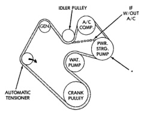
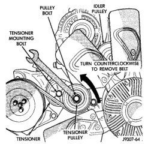

## REMOVAL AND INSTALLATION (Continued)

*Fig. 87 Belt Routing—3.9L V-6 or 5.2/5.9L V-8 LDC-Gas Engines*

*If vehicle is not equipped with power steering, this will be an idler pulley.

*Fig. 87 Belt Routing—3.9L V-6 or 5.2/5.9L V-8 LDC-Gas Engines*

*Fig. 88 Belt Tensioner—5.9L HDC-Gas and 8.0L V-10 Engines—Typical*

**CAUTION: When installing the accessory drive belt, the belt must be routed correctly. If not, engine may overheat due to water pump rotating in wrong direction. Refer to (Fig. 89) (Fig. 90) for correct engine belt routing. The correct belt with correct length must be used.**

**CAUTION: If the pulley is to be removed from the tensioner, its mounting bolt has left-hand threads.**

##### INSTALLATION

1. Position drive belt over all pulleys **except** tensioner pulley.

2. Attach a socket/wrench to pulley mounting bolt of automatic tensioner (Fig. 88).

3. Rotate socket/wrench counterclockwise. Install belt over tensioner pulley. Let tensioner rotate back into place. Remove wrench. Be sure belt is properly seated on all pulleys.

*Fig. 87 Belt Routing—5.9L HDC-Gas Engine and 8.0L V-10—With A/C*

#### 5.9L DIESEL ENGINE

##### REMOVAL

Drive belts on diesel engines are equipped with a spring loaded automatic belt tensioner (Fig. 91). (Fig. 91) displays the tensioner for vehicles without air conditioning.

This belt tensioner will be used on all belt configurations, such as with or without air conditioning. For more information, refer to Automatic Belt Tensioner, proceeding in this group.

1. A 3/8 inch square hole is provided in the automatic belt tensioner (Fig. 91). Attach a 3/8 inch drive-long handle ratchet to this hole.

2. Rotate ratchet and tensioner assembly counterclockwise (as viewed from front) until tension has been relieved from belt.

3. Remove belt from water pump pulley first.

4. Remove belt from vehicle.
