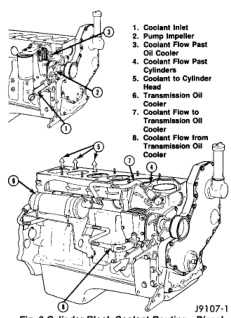
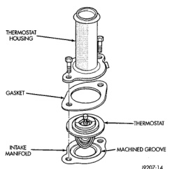
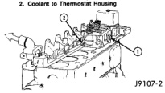
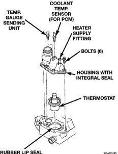

## GENERAL INFORMATION (Continued)

*Fig. 3 Cylinder Block Coolant Routing—Diesel Engine*

1. Coolant Inlet
2. Pump Impeller
3. Coolant Flow Past Oil Cooler
4. Coolant Flow Past Cylinders
5. Coolant to Cylinder Head
6. Transmission Oil Cooler
7. Coolant Flow to Transmission Oil Cooler
8. Coolant Flow from Transmission Oil Cooler

*Fig. 4 Cylinder Head Coolant Routing—Diesel Engine*

1. Coolant Flow from Cylinder Block
2. Coolant to Thermostat Housing

### RADIATORS

The radiator used on all engines (both gas powered and diesel) are of a cross-flow design with horizontal tubes through the radiator core and vertical side tanks.

Aluminum cores with plastic side tanks are used on all 3.9L V-6 and 5.2/5.9L V-8 engines. Copper-brass cores are used with the 8.0L V-10 and diesel engines.

The radiator supplies sufficient heat transfer to cool the engine and automatic transmission (if equipped).

### THERMOSTAT

The thermostat on all gas powered engines is located beneath the thermostat housing at the front of the intake manifold (Fig. 5) (Fig. 6).

*Fig. 5 Thermostat—3.9L V-6 or 5.2/5.9L V-8 Gas Powered Engines*

*Fig. 6 Thermostat—8.0L V-10 Engine*
