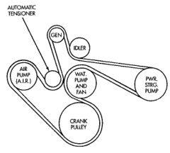
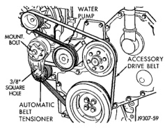

## REMOVAL AND INSTALLATION (Continued)

*Fig. 90 Belt Routing—5.9L HDC-Gas Engine and 8.0L V-10—Without A/C*

*Fig. 91 Belt Tensioner—5.9L Diesel—Typical (non-A/C shown)*

**CAUTION: When installing the accessory drive belt, the belt must be routed correctly. If not, engine may overheat due to water pump rotating in wrong direction. Refer to (Fig. 92) (Fig. 93) for correct engine belt routing. The correct belt with correct length must be used.**

##### INSTALLATION

1. Position drive belt over all pulleys **except** water pump pulley.

2. Attach a 3/8 inch ratchet to tensioner.

3. Rotate ratchet and belt tensioner counterclockwise. Place belt over water pump pulley. Let tensioner rotate back into place. Remove ratchet. Be sure belt is properly seated on all pulleys.

*Fig. 90*

*Power steering pump is not belt driven

*Fig. 92 Belt Routing—5.9L Diesel Engine—With A/C*

*Fig. 91*

*Power steering pump is not belt driven

*Fig. 93 Belt Routing—5.9L Diesel Engine—Without A/C*
