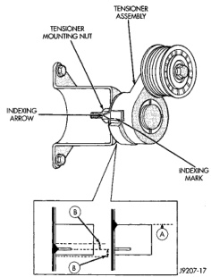

## REMOVAL AND INSTALLATION (Continued)

### AUTOMATIC BELT TENSIONER

**NOTE:** On 3.9L V-6 or 5.2/5.9L V-8 LDC-gas engines, the tensioner is equipped with an indexing arrow (Fig. 94) on back of tensioner and an indexing mark on tensioner housing. If a new belt is being installed, arrow must be within approximately 3 mm (1/8 in.) of indexing mark (point B) (Fig. 94). Belt is considered new if it has been used 15 minutes or less. If this specification cannot be met, check for:

- The wrong belt being installed (incorrect length/width)
- Worn bearings on an engine accessory (A/C compressor, power steering pump, water pump, idler pulley or generator)
- A pulley on an engine accessory being loose
- Misalignment of an engine accessory
- Belt incorrectly routed

On 3.9L V-6 or 5.2/5.9L V-8 LDC-gas engines, a used belt should be replaced if tensioner indexing arrow has moved to point-A (Fig. 94). Tensioner travel stops at point-A.

*Fig. 94 Indexing Marks—3.9L V-6 or 5.2/5.9L V-8 LDC-Gas Engines*

#### 3.9L V-6 OR 5.2/5.9L V-8 LDC-GAS ENGINES

##### REMOVAL

1. Remove accessory drive belt. Refer to Belt Removal/Installation in this group.

2. Disconnect wiring and secondary cable from ignition coil.

3. Remove ignition coil from coil mounting bracket (two bolts). Do not remove coil mounting bracket from cylinder head.

4. Remove tensioner assembly from mounting bracket (one nut) (Fig. 94).

**WARNING: BECAUSE OF HIGH SPRING PRESSURE, DO NOT ATTEMPT TO DISASSEMBLE AUTOMATIC TENSIONER. UNIT IS SERVICED AS AN ASSEMBLY (EXCEPT FOR PULLEY).**

5. Remove pulley bolt. Remove pulley from tensioner.

##### INSTALLATION

1. Install pulley and pulley bolt to tensioner. Tighten bolt to 61 N·m (45 ft. lbs.) torque.

2. Install tensioner assembly to mounting bracket. An indexing tab is located on back of tensioner. Align this tab to slot in mounting bracket. Tighten nut to 67 N·m (50 ft. lbs.) torque.

3. Connect all wiring to ignition coil.

4. Install coil to coil bracket. If nuts and bolts are used to secure coil to coil bracket, tighten to 11 N·m (100 in. lbs.) torque. If coil mounting bracket has been tapped for coil mounting bolts, tighten bolts to 5 N·m (50 in. lbs.) torque.

**CAUTION: To prevent damage to coil case, coil mounting bolts must be torqued.**

5. Install drive belt. Refer to Belt Removal/Installation in this group.

6. Check belt indexing marks (Fig. 94).

#### 5.9L HDC-GAS AND 8.0L V-10 ENGINES

##### REMOVAL

1. Remove accessory drive belt. Refer to Belt Removal/Installation in this group.

2. Remove tensioner mounting bolt (Fig. 95) and remove tensioner.

**CAUTION: If the pulley is to be removed from the tensioner, its mounting bolt has left-hand threads.**

**WARNING: BECAUSE OF HIGH SPRING PRESSURE, DO NOT ATTEMPT TO DISASSEMBLE AUTOMATIC TENSIONER. UNIT IS SERVICED AS AN ASSEMBLY (EXCEPT FOR PULLEY).**
