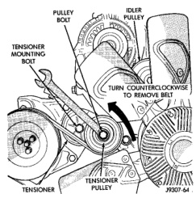
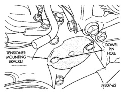
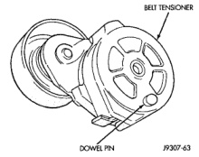

## REMOVAL AND INSTALLATION (Continued)

*Fig. 95 Belt Tensioner—5.9L HDC-Gas and 8.0L V-10*

##### INSTALLATION

1. Install pulley and pulley bolt to tensioner (observe the previous CAUTION). Tighten bolt to 88 N·m (65 ft. lbs.) torque.

2. Install tensioner assembly to mounting bracket. A dowel pin is located on back of tensioner (Fig. 96). Align this to dowel hole (Fig. 97) in tensioner mounting bracket. Tighten bolt to 41 N·m (30 ft. lbs.) torque.

*Fig. 96 Tensioner Dowel Pin—5.9L HDC-Gas and 8.0L V-10 Engines*

3. Install drive belt. Refer to Belt Removal/Installation in this group.

*Fig. 97 Tensioner Dowel Hole—5.9L HDC-Gas and 8.0L V-10 Engines*

#### 5.9L DIESEL ENGINE

##### REMOVAL

1. Remove accessory drive belt. Refer to Belt Removal/Installation in this group.

2. Remove tensioner mounting bolt (Fig. 95) and remove tensioner.

**WARNING: BECAUSE OF HIGH SPRING PRESSURE, DO NOT ATTEMPT TO DISASSEMBLE AUTOMATIC TENSIONER. UNIT IS SERVICED AS AN ASSEMBLY.**

##### INSTALLATION

1. Install tensioner assembly to mounting bracket. A dowel is located on back of tensioner. Align this dowel to hole in tensioner mounting bracket. Tighten bolt to 41 N·m (30 ft. lbs.) torque.

2. Install drive belt. Refer to Belt Removal/Installation in this group.

### COOLING SYSTEM FAN—GAS ENGINES

#### REMOVAL

**CAUTION: If the viscous fan drive is replaced because of mechanical damage, the cooling fan blades should also be inspected. Inspect for fatigue cracks, loose blades, or loose rivets that could have resulted from excessive vibration. Replace fan blade assembly if any of these conditions are found. Also inspect water pump bearing and shaft assembly for any related damage due to a viscous fan drive malfunction.**

1. Disconnect negative battery cable from battery.

2. Remove throttle cable at top of fan shroud.
