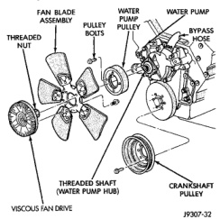

## REMOVAL AND INSTALLATION (Continued)

3. All Except 8.0L V-10 Engine: Unsnap coolant reserve/overflow tank from fan shroud and lay aside. The tank is held to shroud with T-shaped slots. Do not disconnect hose or drain coolant from tank.

4. The thermal viscous fan drive/fan blade assembly is attached (threaded) to water pump hub shaft (Fig. 98). Remove fan blade/viscous fan drive assembly from water pump by turning mounting nut counterclockwise as viewed from front. Threads on viscous fan drive are **RIGHT-HAND**. A Snap-On 36 MM Fan Wrench (number SP346 from Snap-On Cummins Diesel Tool Set number 2017DSP) can be used. Place a bar or screwdriver between water pump pulley bolts (Fig. 98) to prevent pulley from rotating.

5. Do not attempt to remove fan/viscous fan drive assembly from vehicle at this time.

*Fig. 98 Fan Blade/Viscous Fan Drive—Gas Engines—Typical*

6. Do not unbolt fan blade assembly (Fig. 98) from viscous fan drive at this time.

7. Remove four fan shroud-to-radiator mounting bolts.

8. Remove fan shroud and fan blade/viscous fan drive assembly as a complete unit from vehicle.

9. After removing fan blade/viscous fan drive assembly, **do not** place viscous fan drive in horizontal position. If stored horizontally, silicone fluid in the viscous fan drive could drain into its bearing assembly and contaminate lubricant.

**CAUTION: Do not remove water pump pulley-to-water pump bolts (Fig. 98). This pulley is under spring tension.**

10. Remove four bolts securing fan blade assembly to viscous fan drive (Fig. 98).

**CAUTION: Some engines equipped with serpentine drive belts have reverse rotating fans and viscous fan drives. They are marked with the word REVERSE to designate their usage. Installation of the wrong fan or viscous fan drive can result in engine overheating.**

#### INSTALLATION

1. Install fan blade assembly to viscous fan drive. Tighten bolts (Fig. 98) to 23 N·m (17 ft. lbs.) torque.

2. Position fan shroud and fan blade/viscous fan drive assembly to vehicle as a complete unit.

3. Install fan shroud.

4. Install fan blade/viscous fan drive assembly to water pump shaft (Fig. 98).

5. Except 8.0L V-10 Engine: Install coolant reserve/overflow tank to fan shroud. Snaps into position.

6. Install throttle cable to fan shroud.

7. Connect negative battery cable.

**NOTE: Viscous Fan Drive Fluid Pump Out Requirement: After installing a new viscous fan drive, bring the engine speed up to approximately 2000 rpm and hold for approximately two minutes. This will ensure proper fluid distribution within the drive.**

### COOLING SYSTEM FAN DRIVE—DIESEL ENGINE

#### REMOVAL

**CAUTION: If the viscous fan drive is replaced because of mechanical damage, the cooling fan blades should also be inspected. Inspect for fatigue cracks, loose blades, or loose rivets that could have resulted from excessive vibration. Replace fan blade assembly if any of these conditions are found. Also inspect water pump bearing and shaft assembly for any related damage due to a viscous fan drive malfunction.**

1. Disconnect both negative battery cables at both batteries.

2. Remove the fan shroud mounting bolts. Position fan shroud towards engine.

**CAUTION: Do not remove the fan pulley bolts. This pulley is under spring tension.**

3. The thermal viscous fan drive/fan blade assembly is attached (threaded) to the fan hub shaft (Fig. 99). Remove the fan blade/fan drive assembly from fan pulley by turning the mounting nut clockwise (as
