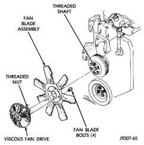
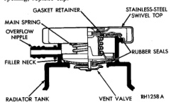

## REMOVAL AND INSTALLATION (Continued)

viewed from front). Threads on the viscous fan drive are **LEFT-HAND**. A Snap-On 36 MM Fan Wrench (number SP346 from Snap-On Cummins Diesel Tool Set number 2017DSP) can be used. Place a bar or screwdriver between the fan pulley bolts to prevent pulley from rotating.

*Fig. 99 Fan Blades/Viscous Fan Drive—5.9L Diesel*

4. Remove the fan shroud and the fan blade/viscous drive as an assembly from vehicle.

5. Remove fan blade-to-viscous fan drive mounting bolts.

6. Inspect the fan for cracks, loose rivets, loose or bent fan blades.

**CAUTION: Some engines equipped with serpentine drive belts have reverse rotating fans and viscous fan drives. They are marked with the word REVERSE to designate their usage. Installation of the wrong fan or viscous fan drive can result in engine overheating.**

#### INSTALLATION

1. Install fan blade assembly to viscous fan drive. Tighten mounting bolts to 23 N·m (17 ft. lbs.) torque.

2. Position the fan shroud and fan blade/viscous fan drive to the vehicle as an assembly.

3. Install viscous fan drive assembly on fan hub shaft. Tighten mounting nut to 57 N·m (42 ft. lbs.) torque.

4. Install fan shroud bolts.

5. Install battery cables to batteries.

**NOTE: Viscous Fan Drive Fluid Pump Out Requirement: After installing a new viscous fan drive, bring the engine speed up to approximately 2000 rpm and hold for approximately two minutes. This will ensure proper fluid distribution within the drive.**

## CLEANING AND INSPECTION

### RADIATOR CAP

#### INSPECTION

Hold cap at eye level, right side up. The vent valve (Fig. 100) at bottom of cap should open. If rubber gasket has swollen and prevents vent valve from opening, replace cap.

*Fig. 100 Radiator Pressure Cap*

Hold cap at eye level, upside down. If any light can be seen between vent valve and rubber gasket, replace cap. **Do not use a replacement cap that has a spring to hold vent shut.** A replacement cap must be the type designed for a coolant reserve/overflow system with a completely sealed diaphragm spring and a rubber gasket. This gasket is used to seal to radiator filler neck top surface. Use of proper cap will allow coolant return to radiator.

### RADIATOR

#### CLEANING

The radiator and air conditioning fins should be cleaned when an accumulation of bugs, leaves etc. has occurred. Clean radiator fins are necessary for good heat transfer. With the engine cold, apply cold water and compressed air to the back (engine side) of the radiator to flush the radiator and/or A/C condenser of debris.

### WATER PUMP INSPECTION

Replace water pump assembly if it has any of the following conditions:

- The body is cracked or damaged
