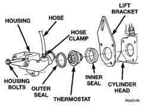

## GENERAL INFORMATION (Continued)

The thermostat of the 5.9L diesel engine is located in the thermostat housing (Fig. 7). The housing is located behind the generator mounting bracket, at front of cylinder head.

*Fig. 7 Thermostat—5.9L Diesel—Typical*

Gas powered engines: The thermostat is a wax pellet driven, reverse poppet choke type (3.9L/5.2L/5.9L), or moveable sleeve type (8.0L V-10). The wax pellet is located in a sealed container at the spring end of the thermostat. When heated, the pellet expands, overcoming closing spring tension and water pump pressure to force the valve to open. Coolant leakage into the pellet container will cause the thermostat to fail in the open position. Thermostats very rarely stick. Do not attempt to free a thermostat with a prying device.

The same thermostat is used for winter and summer seasons. An engine should not be operated without a thermostat, except for servicing or testing. Operating without a thermostat causes longer engine warmup time, unreliable warmup performance, increased exhaust emissions and crankcase condensation that can result in sludge formation.

**CAUTION: Do not operate an engine without a thermostat, except for servicing or testing.**

### ENGINE ACCESSORY DRIVE BELTS

All vehicles are available with either a 3.9L V-6, a 5.2L V-8, two different 5.9L V-8 engines, an 8.0L V-10 or a 5.9L in-line 6 cylinder diesel engine.

The accessory drive components are operated by a single, crankshaft driven, serpentine drive belt on all engines. An automatic belt tensioner is also used to maintain correct belt tension at all times. This is used on all engines. Refer to Automatic Belt Tensioner proceeding in this group.

### BELT TENSION—ALL ENGINES

Correct accessory drive belt tension is required to be sure of optimum performance of belt driven engine accessories. If specific tension is not maintained, belt slippage may cause; engine overheating, lack of power steering assist, loss of air conditioning capacity, reduced generator output rate and greatly reduced belt life.

It is not necessary to adjust belt tension on any engine. All engines are equipped with an automatic belt tensioner. The tensioner maintains correct belt tension at all times. For other tensioner information and removal/installation procedures, refer to Automatic Belt Tensioner proceeding in this group. Due to use of this belt tensioner, do not attempt to use a belt tension gauge on any engine.

## DESCRIPTION AND OPERATION

### THERMOSTAT—V-6, V-8, AND V-10

The thermostat controls the operating temperature of the engine by controlling the amount of coolant flow to the radiator. The thermostat is closed below 88°C (192°F). When the coolant reaches this temperature, the thermostat begins to open, allowing coolant flow to the radiator. This provides quick engine warmup and overall temperature control. The thermostat is designed to provide a minimum engine operating temperature of 88 to 93°C (192 to 199°F). It should be fully open for maximum coolant flow during operation in hot ambient temperatures of approximately 104°C (220°F). Above 104°C (220°F), coolant temperature is controlled by the radiator, fan and ambient temperature.

### THERMOSTAT—DIESEL

The thermostat controls the operating temperature of the engine by controlling the amount of coolant flow to the radiator. When coolant temperature is below 83°C (181°F), the thermostat is closed (Fig. 8).

When coolant temperature reaches 83°C (181°F), the thermostat begins to open allowing coolant flow to the radiator. This provides quick engine warm-up and overall temperature control. The thermostat is designed to provide a minimum engine operating temperature of 83°C (181°F) and to be fully open for maximum coolant flow at approximately 95°C (203°F). Above 95°C (203°F), coolant temperature is controlled by the radiator, fan and ambient temperature.

The air bleeds (jiggle pins) that were used on the thermostats of diesel engines in previous years are no longer used. They have been replaced by a vertically mounted one-way check valve (jiggle pin) and a rubber bypass hose. The check valve is used as a servicing feature and will vent air when the system is
