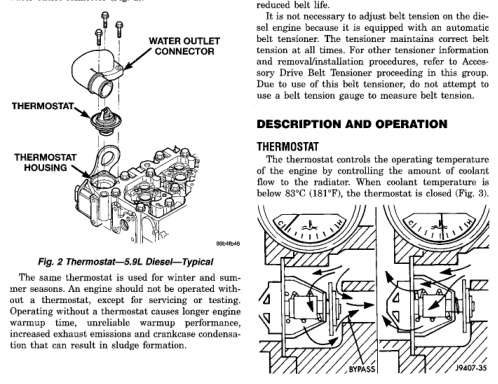

# 7-4 COOLING SYSTEM — BR

## GENERAL INFORMATION (Continued)

### RADIATOR PRESSURE CAP

Radiators are equipped with a pressure cap, which releases pressure at some point within a range of 97-124 kPa (14-18 psi). The pressure relief point (in pounds) is engraved on top of cap. See Description and Operation in this group for more information.

### RADIATOR

The radiator used on the diesel engine is of a crossflow design with horizontal tubes through the radiator core and vertical side tanks. The radiator consists of an aluminum core and uses brass side tanks. The radiator supplies sufficient heat transfer to cool the engine and automatic transmission (if equipped).

### THERMOSTAT

The thermostat of the 5.9L diesel engine is located in the front of the cylinder head, underneath the water outlet connector (Fig. 2).

*Fig. 2 Thermostat—5.9L Diesel—Typical - Diagram showing:*

The same thermostat is used for winter and summer seasons. An engine should not be operated without a thermostat, except for servicing or testing. Operating without a thermostat causes longer engine warmup time, unreliable warmup performance, increased emissions and an engine operating condition that can result in sludge formation.

**CAUTION: Do not operate an engine without a thermostat, except for servicing or testing. An engine with the thermostat removed will operate in the radiator bypass mode, causing an overheat condition.**

### ACCESSORY DRIVE BELT AND TENSION

The accessory drive components are driven by a single, crankshaft driven, serpentine accessory drive belt on all engines. An automatic belt tensioner is also used to maintain correct belt tension at all times. This is used on all engines. Refer to Automatic Belt Tensioner proceeding in this group.

Correct accessory drive belt tension is required to be sure of optimum performance of belt driven engine accessories. If specific tension is not maintained, belt slippage may cause; engine overheating, lack of power steering assist, loss of air conditioning capacity, reduced generator output rate and greatly reduced belt life.

It is not necessary to adjust belt tension on the diesel engine because it is equipped with an automatic belt tensioner. The tensioner maintains correct belt tension at all times. For other tensioner information and removal/installation procedures, refer to Accessory Drive Belt Tensioner proceeding in this group. Due to use of this belt tensioner, do not attempt to use a belt tension gauge to measure belt tension.

## DESCRIPTION AND OPERATION

### THERMOSTAT

The thermostat controls the operating temperature of the engine by regulating the amount of coolant flow to the radiator. When coolant temperature is below 88°C (181°F), the thermostat is closed (Fig. 3).

*Fig. 2 Thermostat Operation—5.9L Diesel—Typical - Two diagrams showing thermostat in closed and open positions with bypass flow paths]*