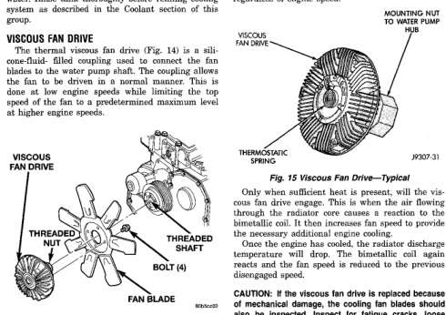

# DESCRIPTION AND OPERATION (Continued)

Refer to Coolant Level Check—Service, Deaeration and Radiator Pressure Cap sections in this group for coolant reserve/overflow system operation and service.

Should the reserve/overflow tank become coated with corrosion, it can be cleaned with detergent and water. Rinse tank thoroughly before refilling cooling system as described in the Coolant Section of this group.

## VISCOUS FAN DRIVE

The thermal viscous fan drive (Fig. 14) is a silicone-fluid—filled coupling used to connect the fan blades to the water pump shaft. The coupling allows the fan to be driven at a predetermined minimum level done at low engine speeds while limiting the top speed of the fan to a predetermined maximum level at higher engine speeds.

*Fig. 15 Viscous Fan Drive Assembly]*
- VISCOUS FAN DRIVE
- THREADED NUT
- FAN BLADE
- THREADED SHAFT
- BOLT (4)

A thermostatic bimetallic spring coil is located on the front face of the viscous fan drive unit (a typical viscous unit is shown in (Fig. 15). This spring coil reacts to the temperature of the radiator discharge air. It engages the viscous fan drive for higher fan speed if the air temperature from the radiator rises above a certain point. Until additional engine cooling is necessary, the fan will remain at a reduced rpm regardless of engine speed.

*Fig. 15 Viscous Fan Drive—Typical]*
- MOUNTING NUT TO WATER PUMP
- VISCOUS FAN DRIVE
- THERMOSTATIC SPRING

Only when sufficient heat is present, will the viscous fan drive engage. This is when the air flowing through the radiator causes a reaction to the bimetallic coil. It then increases fan speed to provide the necessary additional engine cooling.

Once the engine has cooled, the radiator discharge temperature will drop. The bimetallic coil again reacts and the fan speed is relaxed to the previous disengaged speed.

**CAUTION:** If the viscous fan drive is replaced because of mechanical damage, the cooling fan blades should also be inspected. Inspect for fatigue cracks, loose blades, or loose rivets that could have resulted from excessive vibration. Replace fan blade assembly if any of these conditions are found. Also inspect water pump bearing and shaft assembly for any related damage due to a viscous fan drive malfunction.