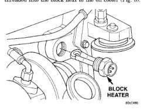
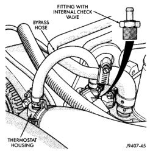
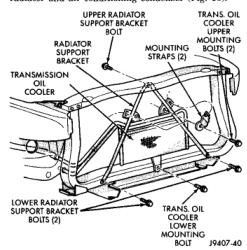

## DESCRIPTION AND OPERATION (Continued)

*Fig. 8 Thermostat Operation—5.9L Diesel—Typical*

being filled. It is also used to block the flow of coolant during engine operation (all coolant will pass through the thermostat).

Water pressure (or flow) will hold the pin closed. When the engine is off, the check valve will be in the open position. When the engine is operating, the check valve will be in the closed position.

The check valve is located inside of a brass fitting. This fitting is threaded into the front of the cylinder head (Fig. 9). It is connected to the thermostat housing with a rubber hose and screw-type clamps (Fig. 9).

*Fig. 9 One-Way Check Valve (Jiggle Pin) Location*

### AUTOMATIC TRANSMISSION OIL COOLERS—GAS ENGINES

#### WATER-TO-OIL COOLER

All gas powered models equipped with an automatic transmission are equipped with a transmission oil cooler mounted internally within the radiator side tank. This internal cooler is supplied as standard equipment on all gas powered models equipped with an automatic transmission.

The internal radiator oil cooler is **not used** with the diesel engine.

Transmission oil is cooled when it passes through this separate cooler. In case of a leak in the internal radiator mounted transmission oil cooler, engine coolant may become mixed with transmission fluid or transmission fluid may enter engine cooling system. Both cooling system and transmission should be drained and inspected if the internal radiator mounted transmission cooler is leaking.

Also refer to the section on Transmission Air-to-Oil Coolers. This heavy duty air-to-oil cooler is an option on most engine packages. It is supplied as standard equipment on both the 8.0L V-10 and 5.9L diesel engines.

### AUXILIARY TRANSMISSION OIL COOLER

**3.9/5.2/5.9L V-8 Gas Powered Engines:** An optional air-to-oil transmission oil cooler is available with most engine packages. On the 3.9/5.2/5.9L V-8 engines, this optional cooler is located between the radiator and air conditioning condenser (Fig. 10).

*Fig. 10 Auxiliary Transmission Oil Cooler—3.9/5.2/5.9L Engines*
