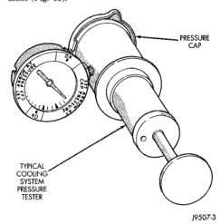

(6) Apply heat to the water while observing the thermostat and thermometer. (7) When the water temperature reaches 83℃ (181°F) the thermostat should start to open (valve will start to move). If the valve starts to move before this temperature is reached, it is opening too early. Replace thermostat. The thermostat should be fully open (valve will stop moving) at 95℃ (203°F). (7) If the valve is still moving when the water temperature reaches 203°, it is opening too late. Replace thermostat. (7) If the valve refuses to move at any time. replace thermostat.

A quick test to determine if pump is working is to check if heater warms properly. A defective water pump will not be able to circulate heated coolant through the long heater hose to the heater core.

The pressure cap upper gasket (seal) pressure relief can be tested by removing overflow hose from radiator filler neck nipple. Attach hose of pressure tester tool 7700 (or equivalent) to nipple. It will be necessary to disconnect hose from its adapter for filler neck. Pump air into radiator. The pressure cap upper gasket should relieve at 69-124 kPa (10-18 psi) and hold pressure at a minimum of 55 kPa (8 psi).

WARNING: THE WARNING WORDS -DO NOT OPEN HOT- ON RADIATOR PRESSURE CAP, ARE A SAFETY PRECAUTION. WHEN HOT, PRESSURE BUILDS UP IN COOLING SYSTEM. TO PREVENT SCALDING OR INJURY, RADIATOR CAP SHOULD NOT BE REMOVED WHILE SYSTEM IS HOT AND/OR UNDER PRESSURE.

Do not remove radiator cap at any time except for the following purposes:

• · Check and adjust antifreeze freeze point · Refill system with new antifreeze · Conducting service procedures · Checking for vacuum leaks

WARNING: IE VEHICLE HAS BEEN RUN RECENTLY. WAIT AT LEAST 15 MINUTES BEFORE RADIATOR CAP. REMOVING WITH A RAG, SQUEEZE RADIATOR UPPER HOSE TO CHECK IF SYSTEM IS UNDER PRESSURE. PLACE A RAG OVER CAP AND WITHOUT PUSHING CAP DOWN, ROTATE IT COUNTER-CLOCKWISE TO FIRST STOP. ALLOW FLUID TO ESCAPE THROUGH THE COOL- ANT RESERVE/OVERFLOW HOSE INTO RESERVE/ OVERFLOW TANK. SQUEEZE RADIATOR UPPER HOSE TO DETERMINE WHEN PRESSURE HAS

BEEN RELEASED. WHEN COOLANT AND STEAM STOP BEING PUSHED INTO TANK AND SYSTEM PRESSURE DROPS, REMOVE RADIATOR CAP COMPLETELY.

Remove cap from radiator. Be sure that sealing surfaces are clean. Moisten rubber gasket with water and install cap on pressure tester 7700 or an equivalent (Fig. 19).

!

*Fig. 19*(page_78_fig_19.jpg)

*Fig. 19*

*19507-3*

*Fig. 19 Pressure Testing Radiator Cap-Typical*

Operate tester pump to bring pressure to 104 kPa (15 psi) on gauge. If pressure cap fails to hold pressure of at least 97 kPa (14 psi) replace cap. Refer to CAUTION below. The pressure cap may test properly while positioned on tool 7700 (or equivalent). It may not hold pressure or vacuum when installed on radiator. If so, inspect radiator filler neck and cap's top gasket for damage. Also inspect for dirt or distortion that may prevent cap from sealing properly.

CAUTION: Radiator pressure testing tools are very sensitive to small air leaks, which will not cause cooling system problems. A pressure cap that does not have a history of coolant loss should not be replaced just because it leaks slowly when tested with this tool. Add water to tool. Turn tool upside down and recheck pressure cap to confirm that cap needs replacement.
