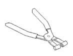
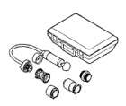
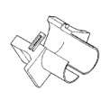

# COOLING SYSTEM 7-33

## SPECIFICATIONS

### TORQUE

| DESCRIPTION | TORQUE |
|-------------|--------|
| Belt Tensioner Bolt | 41 N·m (30 ft. lbs.) |
| Block Heater Hex | 43 N·m (32 ft. lbs.) |
| Fan Blade-to-Viscous Drive Bolts | 23 N·m (17 ft. lbs.) |
| Fan Drive Pulley-to-Fan Hub Bolts | 9 N·m (84 in. lbs.) |
| Fan Shroud to Radiator Mounting Bolts | 6 N·m (50 in. lbs.) |
| Fan Support/Hub Assy. Bolts | 24 N·m (18 ft. lbs.) |
| Radiator Mounting Bolts | 11 N·m (96 in. lbs.) |
| Thermal Viscous Fan-to-Hub Nut | 57 N·m (42 ft. lbs.) |
| Water Inlet Connector-to-Block Bolts | 24 N·m (18 ft. lbs.) |
| Water Outlet Connector (Therm. Housing) Bolts | 24 N·m (18 ft. lbs.) |
| Water Pump-to-Block Bolts | 24 N·m (18 ft. lbs.) |

## SPECIAL TOOLS

### COOLING

*Fig. 2 Pliers 6094*

*Fig. 3 1/2" Disconnect Tool-6931*

*Fig. 4 Pressure Tester 7700-A*