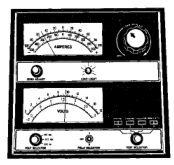

# DIAGNOSIS AND TESTING (Continued)

(5) Rotate the load control knob to maintain a load equal to 50% of the CCA rating of the battery (Fig. 9). After fifteen seconds, record the loaded voltage reading, then return the load control knob to the Off position.

*Fig. 9 Load 50% CCA Rating - Note Voltage - Typical*

(6) The voltage drop will vary with the battery temperature at the time of the load test. The battery temperature can be estimated by using the ambient temperature during the past several hours. If the battery has been charged, boosted, or loaded a few minutes prior to the test, the battery will be somewhat warmer. See the Load Test Temperature chart for the proper loaded voltage reading.

| Load Test Temperature | | |
|---|---|---|
| Minimum Voltage | Temperature ||
| | °F | °C |
| 9.6 volts | 70° and above | 21° and above |
| 9.5 volts | 60° | 16° |
| 9.4 volts | 50° | 10° |
| 9.3 volts | 40° | 4° |
| 9.1 volts | 30° | -1° |
| 8.9 volts | 20° | -7° |
| 8.7 volts | 10° | -12° |
| 8.5 volts | 0° | -18° |

(7) If the voltmeter reading falls below 9.6 volts, at a minimum battery temperature of 21° C (70° F), the battery is faulty and must be replaced.

## IGNITION-OFF DRAW TEST

Ignition-Off Draw (IOD) refers to power being drained from the battery with the ignition switch in the Off position. A normal vehicle electrical system will draw from five to twenty-five milliamperes (0.005 to 0.025 ampere) with the ignition switch in the Off position, and all non-ignition controlled circuits in proper working order. The twenty-five milliamperes are needed to enable the memory functions for the Powertrain Control Module (PCM), digital clock, electronically tuned radio, and other modules which may vary with the vehicle equipment.

A vehicle that has not been operated for approximately twenty days, may discharge the battery to an inadequate level. When a vehicle will not be used for twenty days or more (stored), remove the IOD fuse from the fuseblock module. This will reduce battery discharging.

Excessive IOD can be caused by:
- Electrical items left on
- Faulty or improperly adjusted switches
- Faulty or shorted electronic modules and components
- An internally shorted generator
- Intermittent shorts in the wiring.

If the IOD is over twenty-five milliamperes, the problem must be found and corrected before replacing a battery. In most cases, the battery can be charged and returned to service after the excessive IOD condition has been corrected.

## DIAGNOSIS

**NOTE:** When testing a diesel engine-equipped vehicle (dual batteries), do not check the IOD between batteries. One battery may be at a higher state-of-charge than the other, which will cause a high IOD between the batteries. Remove the negative cable from the passenger side battery negative terminal post prior to performing the IOD diagnosis.

(1) Verify that all electrical accessories are off. Turn off all lamps, remove the ignition key, and close all doors. If the vehicle is equipped with a illuminated entry system or electronically tuned radio, allow the electronic timer function of these systems to automatically shut off (time out). This may take up to three minutes.

(2) Determine that the underhood lamp is operating properly, then unplug the lamp wire harness connector or remove the lamp bulb.

(3) Disconnect the battery negative cable.

(4) Set an electronic digital multi-meter to its highest amperage scale. Connect the multi-meter between the disconnected battery negative cable clamp and the battery negative terminal post. Make sure that the doors remain closed so that the illuminated entry system is not activated. The multi-meter amperage reading may remain high for up to three minutes, or may not give any reading at all while set in the highest amperage scale, depending upon the electrical equipment on the vehicle. The multi-meter leads must be securely clamped to the battery negative cable clamp and the battery negative terminal

---
*8A_Battery - Page 10*
