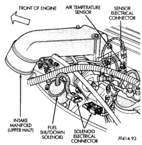
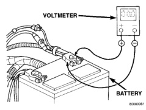
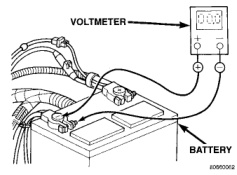
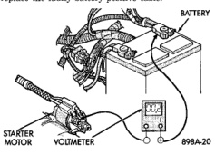

# DIAGNOSIS AND TESTING (Continued)

*Fig. 10 Fuel Shutdown Solenoid Connector - Diesel Engine*

(1) Connect the positive lead of the voltmeter to the battery negative terminal post. Connect the negative lead of the voltmeter to the battery negative cable clamp (Fig. 11). Rotate and hold the ignition switch in the Start position. Observe the voltmeter. If voltage is detected, correct the poor contact between the cable clamp and the terminal post.

*Fig. 11 Test Battery Negative Connection Resistance - Typical*

(2) Connect the positive lead of the voltmeter to the battery positive terminal post. Connect the negative lead of the voltmeter to the battery positive cable clamp (Fig. 12). Rotate and hold the ignition switch in the Start position. Observe the voltmeter. If voltage is detected, correct the poor contact between the cable clamp and the terminal post.

*Fig. 12 Test Battery Positive Connection Resistance - Typical*

(3) Connect the voltmeter to measure between the battery positive terminal post and the starter solenoid battery terminal stud (Fig. 13). Rotate and hold the ignition switch in the Start position. Observe the voltmeter. If the reading is above 0.2 volt, clean and tighten the battery cable connection at the solenoid. Repeat the test. If the reading is still above 0.2 volt, replace the faulty battery positive cable.

*Fig. 13 Test Battery Positive Cable Resistance - Typical*

(4) Connect the voltmeter to measure between the battery negative terminal post and a good clean ground on the engine block (Fig. 14). Rotate and hold the ignition switch in the Start position. Observe the voltmeter. If the reading is above 0.2 volt, clean and tighten the battery negative cable attachment on the engine block. Repeat the test. If the reading is still above 0.2 volt, replace the faulty battery negative cable.

---
*8A_Battery - Page 12*
