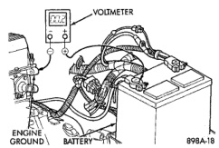

# DIAGNOSIS AND TESTING (Continued)

*Fig. 14 Test Ground Circuit Resistance - Typical*

## SERVICE PROCEDURES

### BATTERY CHARGING

A battery is fully-charged when:
- All cells are gassing freely during battery charging.
- A green color is visible in the sight glass of the built-in test indicator.
- Three corrected specific gravity tests, taken at one-hour intervals, indicate no increase in the specific gravity.
- Open-circuit voltage is 12.4 volts or above.

**WARNING:**
- **IF THE BATTERY SHOWS SIGNS OF FREEZING, LEAKING, LOOSE POSTS, OR LOW ELECTROLYTE LEVEL, DO NOT TEST, ASSIST-BOOST, OR CHARGE. THE BATTERY MAY ARC INTERNALLY AND EXPLODE. PERSONAL INJURY AND/OR VEHICLE DAMAGE MAY RESULT.**
- **EXPLOSIVE HYDROGEN GAS FORMS IN AND AROUND THE BATTERY. DO NOT SMOKE, USE FLAME, OR CREATE SPARKS NEAR THE BATTERY. PERSONAL INJURY AND/OR VEHICLE DAMAGE MAY RESULT.**
- **THE BATTERY CONTAINS SULFURIC ACID, WHICH IS POISONOUS AND CAUSTIC. AVOID CONTACT WITH THE SKIN, EYES, OR CLOTHING. IN THE EVENT OF CONTACT, FLUSH WITH WATER AND CALL A PHYSICIAN IMMEDIATELY. KEEP OUT OF THE REACH OF CHILDREN.**
- **IF THE BATTERY IS EQUIPPED WITH REMOVABLE CELL CAPS, BE CERTAIN THAT EACH OF THE CELL CAPS IS IN PLACE AND TIGHT BEFORE THE BATTERY IS RETURNED TO SERVICE. PERSONAL INJURY AND/OR VEHICLE DAMAGE MAY RESULT FROM LOOSE OR MISSING CELL CAPS.**

**CAUTION:**
- **Always disconnect and isolate the battery negative cable before charging a battery. Do not exceed sixteen volts while charging a battery. Damage to the vehicle electrical system components may result.**
- **Battery electrolyte will bubble inside the battery case during normal battery charging. Electrolyte boiling or being discharged from the battery vents indicates a battery overcharging condition. Immediately reduce the charging rate or turn off the charger to evaluate the battery condition. Damage to the battery may result from overcharging.**
- **The battery should not be hot to the touch. If the battery feels hot to the touch, turn off the charger and let the battery cool before continuing the charging operation. Damage to the battery may result.**

**NOTE:** Models equipped with the diesel engine option are equipped with two 12-volt batteries, connected in parallel (positive-to-positive/negative-to-negative). The secondary battery, on the passenger side, is dedicated to providing current for the operation of the intake manifold air heater. The primary battery, on the driver side, is dedicated to all other vehicle electrical requirements. In order to ensure proper charging of each battery, these batteries MUST be disconnected from each other, as well as from the vehicle electrical system, while being charged.

Some battery chargers are equipped with polarity-sensing circuitry. This circuitry protects the charger and/or the battery from being damaged if they are improperly connected. If the battery state-of-charge is too low for the polarity-sensing circuitry to detect, the charger will not operate. This makes it appear that the battery will not accept charging current. Refer to the instructions provided with the battery charger to bypass the polarity-sensing circuitry.

After the battery has been charged to 12.4 volts or greater, perform a load test to determine the battery cranking capacity. If the battery will endure a load test, return the battery to use. If the battery will not endure a load test, it is faulty and must be replaced.

Clean and inspect the battery holddowns, tray, terminals, posts, and top before completing service. See Battery in the Removal and Installation section of this group for the cleaning and inspection procedures.

---
*8A_Battery - Page 13*
