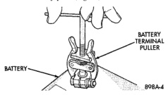
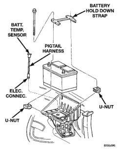

# REMOVAL AND INSTALLATION

## BATTERY

(1) Turn the ignition switch to the Off position. Make sure all electrical accessories are turned off.

(2) Loosen the cable terminal clamps and disconnect both battery cables, negative cable first. If necessary, use a puller to remove the terminal clamps from the battery posts (Fig. 16).

*Fig. 16 Remove Battery Cable Terminal Clamp - Typical*

(3) Inspect the cable terminal clamps for corrosion and damage. Remove any corrosion using a wire brush or a post and terminal cleaning tool, and a sodium bicarbonate (baking soda) and warm water cleaning solution (Fig. 17). Replace any cable that has damaged or deformed terminal clamps.

*Fig. 17 Clean Battery Cable Terminal Clamp - Typical*

**WARNING: WEAR A SUITABLE PAIR OF RUBBER GLOVES (NOT THE HOUSEHOLD TYPE) WHEN REMOVING A BATTERY BY HAND. SAFETY GLASSES SHOULD ALSO BE WORN. IF THE BATTERY IS CRACKED OR LEAKING, THE ELECTROLYTE CAN BURN THE SKIN AND EYES.**

(4) Remove the battery holddowns and remove the battery from the vehicle (Fig. 18) or (Fig. 19).

*Fig. 18 Left Battery Holddowns*

---
*8A_Battery - Page 15*
