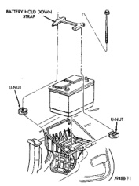
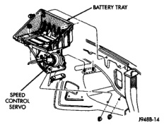
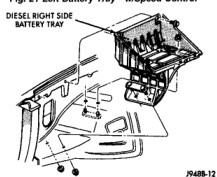
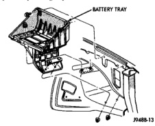

# REMOVAL AND INSTALLATION (Continued)

*Fig. 19 Right Battery Holddowns - Diesel Engine*

(5) Inspect the battery tray and holddowns for corrosion or damage (Fig. 20), (Fig. 21) or (Fig. 22). Remove any corrosion using a wire brush and a sodium bicarbonate (baking soda) and warm water cleaning solution. Paint any exposed bare metal and replace any damaged parts.

*Fig. 20 Left Battery Tray - w/o Speed Control*

(6) Inspect the battery case for cracks or other damage that could result in electrolyte leaks. Also, check the battery terminal posts for looseness. Batteries with damaged cases or loose posts must be replaced.

*Fig. 21 Left Battery Tray - w/Speed Control*

*Fig. 22 Right Battery Tray - Diesel Engine*

(7) Inspect the battery built-in test indicator sight glass for an indication of the battery condition. If the electrolyte level is low, the battery must be replaced. If the battery is discharged, charge as required. See Built-In Test Indicator in the Diagnosis and Testing section, and Battery Charging in the Service Procedures section of this group for more information.

(8) If the battery is to be reinstalled, clean the outside of the battery case and the top cover with a sodium bicarbonate (baking soda) and warm water cleaning solution to remove any acid film (Fig. 23). Rinse the battery with clean water. Ensure that the cleaning solution does not enter the battery cells through the vent holes. If the battery is being replaced, see the Battery Ratings and Classifications chart in the Specifications section of this group. Confirm that the replacement battery is the correct size and has the correct ratings for the vehicle.

---
*8A_Battery - Page 16*
