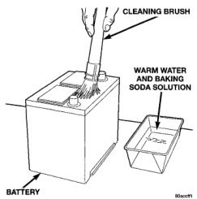
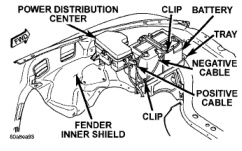
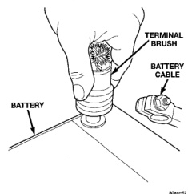

# REMOVAL AND INSTALLATION (Continued)

*Fig. 23 Clean Battery - Typical*

(9) Clean any corrosion from the battery terminal posts with a wire brush or a post and terminal cleaner, and a sodium bicarbonate (baking soda) and warm water cleaning solution (Fig. 24).

*Fig. 24 Clean Battery Terminal Post - Typical*

(10) Position the battery in the tray. Ensure that the positive and negative terminal posts are correctly positioned. The cable terminal clamps must reach the correct battery post without stretching the cables (Fig. 25).

*Fig. 25 Battery Cables - Typical*

(11) Loosely install the battery holddown hardware. Ensure that the battery base is correctly positioned in the tray, then tighten the holddowns to 12 N·m (100 in. lbs.).

**CAUTION: Be certain that the battery cables are connected to the correct battery terminals. Reverse polarity may damage electrical components.**

(12) Install and tighten the battery positive cable terminal clamp. Then install and tighten the battery negative cable terminal clamp. Tighten both battery cable terminal clamp bolts to 4 N·m (35 in. lbs.).

(13) Apply a thin coating of petroleum jelly or chassis grease to the exposed surfaces of the battery cable terminal clamps and battery terminal posts.

---
*8A_Battery - Page 17*
