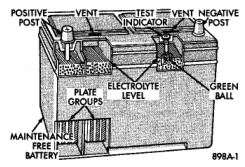

# BATTERY

## CONTENTS

| Section | Page |
|---------|------|
| **GENERAL INFORMATION** | |
| INTRODUCTION | 1 |
| OVERVIEW | 1 |
| **DESCRIPTION AND OPERATION** | |
| BATTERY MOUNTING | 3 |
| BATTERY SIZE AND RATINGS | 2 |
| BATTERY | 2 |
| **DIAGNOSIS AND TESTING** | |
| BATTERY | 3 |
| BUILT-IN TEST INDICATOR | 5 |
| HYDROMETER TEST | 6 |
| IGNITION-OFF DRAW TEST | 10 |
| LOAD TEST | 8 |
| OPEN-CIRCUIT VOLTAGE TEST | 8 |
| VOLTAGE DROP TEST | 11 |
| **SERVICE PROCEDURES** | |
| BATTERY CHARGING | 13 |
| **REMOVAL AND INSTALLATION** | |
| BATTERY | 15 |
| **SPECIFICATIONS** | |
| BATTERY | 18 |

## GENERAL INFORMATION

### OVERVIEW

The battery, starting, and charging systems operate with one another, and must be tested as a complete system. In order for the vehicle to start and charge properly, all of the components involved in these systems must perform within specifications.

Group 8A covers the battery, Group 8B covers the starting system, and Group 8C covers the charging system. Refer to Group 8W - Wiring Diagrams for complete circuit descriptions and diagrams. We have separated these systems to make it easier to locate the information you are seeking within this Service Manual. However, when attempting to diagnose any of these systems, it is important that you keep their interdependency in mind.

The diagnostic procedures used in these groups include the most basic conventional diagnostic methods, to the more sophisticated On-Board Diagnostics (OBD) built into the Powertrain Control Module (PCM). Use of an induction milliampere ammeter, volt/ohmmeter, battery charger, carbon pile rheostat (load tester), and 12-volt test lamp may be required.

All OBD-sensed systems are monitored by the PCM. Each monitored circuit is assigned a Diagnostic Trouble Code (DTC). The PCM will store a DTC in electronic memory for any failure it detects. Refer to the On-Board Diagnostics Test in Group 8C - Charging System for more information.

### INTRODUCTION

This section covers only battery diagnostic and service procedures. For battery maintenance procedures, refer to Group 0 - Lubrication and Maintenance.

While battery charging can be considered a maintenance procedure, battery charging information is located in this group. This was done because the battery must be fully-charged before any diagnosis can be performed.

**The factory-installed maintenance-free battery has non-removable battery vent caps** (Fig. 1). Water cannot be added to this battery. The chemical composition within the maintenance-free battery reduces battery gassing and water loss, at normal charge and discharge rates. Therefore, the battery should not require additional water in normal service.

*Fig. 1 Maintenance-Free Battery - Typical*

If the battery electrolyte level becomes low, the battery must be replaced. However, rapid loss of electrolyte can be caused by an overcharging condition. Be certain to diagnose the charging system before
