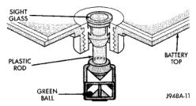

## DIAGNOSIS AND TESTING (Continued)

*Fig. 2 Built-In Test Indicator*

**WARNING:**

- **IF THE BATTERY SHOWS SIGNS OF FREEZING, LEAKING, LOOSE POSTS, OR LOW ELECTROLYTE LEVEL, DO NOT TEST, ASSIST-BOOST, OR CHARGE. THE BATTERY MAY ARC INTERNALLY AND EXPLODE. PERSONAL INJURY AND/OR VEHICLE DAMAGE MAY RESULT.**

- **EXPLOSIVE HYDROGEN GAS FORMS IN AND AROUND THE BATTERY. DO NOT SMOKE, USE FLAME, OR CREATE SPARKS NEAR THE BATTERY. PERSONAL INJURY AND/OR VEHICLE DAMAGE MAY RESULT.**

- **THE BATTERY CONTAINS SULFURIC ACID, WHICH IS POISONOUS AND CAUSTIC. AVOID CONTACT WITH THE SKIN, EYES, OR CLOTHING. IN THE EVENT OF CONTACT, FLUSH WITH WATER AND CALL A PHYSICIAN IMMEDIATELY. KEEP OUT OF THE REACH OF CHILDREN.**

- **IF THE BATTERY IS EQUIPPED WITH REMOVABLE CELL CAPS, BE CERTAIN THAT EACH OF THE CELL CAPS IS IN PLACE AND TIGHT BEFORE THE BATTERY IS RETURNED TO SERVICE. PERSONAL INJURY AND/OR VEHICLE DAMAGE MAY RESULT FROM LOOSE OR MISSING CELL CAPS.**

Before testing, visually inspect the battery for any damage (a cracked case or cover, loose posts, etc.) that would cause the battery to be faulty. In order to obtain correct indications from the built-in test indicator, it is important that the battery be level and have a clean sight glass. Additional light may be required to view the indicator. **Do not use open flame as a source of additional light.**

To read the built-in test indicator, look into the sight glass and note the color of the indicator (Fig. 3). Refer to the following description, as the color indicates:

- **Green** - indicates 75% to 100% state-of-charge. The battery is adequately charged for further testing or return to use. If the starter will not crank for a minimum of fifteen seconds with a fully-charged battery, the battery must be load tested. See Load Test in the Diagnosis and Testing section of this group for more information.

- **Black or Dark** - indicates 0% to 75% state-of-charge. The battery is inadequately charged and must be charged until a green indication is visible in the sight glass (12.4 volts or more), before the battery is tested further or returned to service. See Battery Charging in the Service Procedures section of this group for more information. Also see Abnormal Battery Discharging in the Diagnosis and Testing section of this group for possible causes of the discharged condition.

- **Clear or Bright** - indicates a low electrolyte level. The electrolyte level in the battery is below the test indicator. A maintenance-free battery with non-removable cell caps must be replaced if the electrolyte level is low. Water must be added to a low-maintenance battery with removable cell caps before it is charged. See Battery Charging in the Service Procedures section of this group for more information. A low electrolyte level may be caused by an overcharging condition. Refer to Group 8C - Charging System to diagnose an overcharging condition.

[Figure]

*Fig. 3 Built-In Test Indicator Sight Glass*

### HYDROMETER TEST

The hydrometer test reveals the battery state-of-charge by measuring the specific gravity of the electrolyte. **This test cannot be performed on maintenance-free batteries with non-removable cell caps.** If the battery has non-removable cell caps, see Built-In Test Indicator or Open-Circuit Voltage Test in the Diagnosis and Testing section of this group.

Specific gravity is a comparison of the density of the electrolyte to the density of pure water. Pure water has a specific gravity of 1.000, and sulfuric acid has a specific gravity of 1.835. Sulfuric acid makes up approximately 35% of the electrolyte by weight, or 24% by volume.

In a fully-charged battery the electrolyte will have a temperature-corrected specific gravity of 1.260 to 1.290. However, a specific gravity of 1.235 or above is
