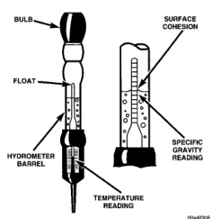

## DIAGNOSIS AND TESTING (Continued)

satisfactory for battery load testing and/or return to service.

**WARNING:**

- **IF THE BATTERY SHOWS SIGNS OF FREEZING, LEAKING, LOOSE POSTS, OR LOW ELECTROLYTE LEVEL, DO NOT TEST, ASSIST-BOOST, OR CHARGE. THE BATTERY MAY ARC INTERNALLY AND EXPLODE. PERSONAL INJURY AND/OR VEHICLE DAMAGE MAY RESULT.**

- **EXPLOSIVE HYDROGEN GAS FORMS IN AND AROUND THE BATTERY. DO NOT SMOKE, USE FLAME, OR CREATE SPARKS NEAR THE BATTERY. PERSONAL INJURY AND/OR VEHICLE DAMAGE MAY RESULT.**

- **THE BATTERY CONTAINS SULFURIC ACID, WHICH IS POISONOUS AND CAUSTIC. AVOID CONTACT WITH THE SKIN, EYES, OR CLOTHING. IN THE EVENT OF CONTACT, FLUSH WITH WATER AND CALL A PHYSICIAN IMMEDIATELY. KEEP OUT OF THE REACH OF CHILDREN.**

- **IF THE BATTERY IS EQUIPPED WITH REMOVABLE CELL CAPS, BE CERTAIN THAT EACH OF THE CELL CAPS IS IN PLACE AND TIGHT BEFORE THE BATTERY IS RETURNED TO SERVICE. PERSONAL INJURY AND/OR VEHICLE DAMAGE MAY RESULT FROM LOOSE OR MISSING CELL CAPS.**

Before testing, visually inspect the battery for any damage (a cracked case or cover, loose posts, etc.) that would cause the battery to be faulty. Then remove the cell caps and check the electrolyte level. Add distilled water if the electrolyte level is below the top of the battery plates.

Refer to the instructions supplied with the hydrometer for recommendations on the correct use of the hydrometer. Remove only enough electrolyte from the battery cell so that the float is off the bottom of the hydrometer barrel with pressure on the bulb released.

**CAUTION: Exercise care when inserting the tip of the hydrometer into a cell to avoid damaging the plate separators. Damaged plate separators can cause early battery failure.**

To read the hydrometer correctly, hold it with the top surface of the electrolyte at eye level (Fig. 4). Hydrometer floats are generally calibrated to indicate the specific gravity correctly only at 26.7°C (80°F). When testing the specific gravity at any other temperature, a correction factor is required.

The correction factor is approximately a specific gravity value of 0.004, referred to as four points of specific gravity. For each 5.5°C above 26.7°C (10°F above 80°F), add four points. For each 5.5°C below 26.7°C (10°F below 80°F), subtract four points.

*Fig. 4 Hydrometer - Typical*

Always correct the specific gravity for temperature variation. Test the specific gravity of the electrolyte in each battery cell.

**EXAMPLE:** A battery is tested at -12.2°C (10°F) and has a specific gravity of 1.240. Determine the actual specific gravity as follows:

1. Determine the number of degrees above or below 26.7°C (80°F):
   - 26.6°C - (-12.2°C) = 38.8°C (80°F - 10°F = 70°F)

2. Divide the result from Step 1 by 5.5 (10):
   - 38.8°C ÷ 5.5 = 7 (70°F ÷ 10 = 7)

3. Multiply the result from Step 2 by the temperature correction factor (0.004):
   - 7 × 0.004 = 0.028

4. The temperature at testing was below 26.7°C (80°F); therefore, the temperature correction factor is subtracted:
   - 1.240 - 0.028 = 1.212

The corrected specific gravity of the battery in this example is 1.212.

If the specific gravity of all cells is above 1.235, but the variation between cells is more than fifty points (0.050), the battery should be replaced. If the specific gravity of one or more cells is less than 1.235, charge the battery at a rate of approximately five amperes.

Continue charging the battery until three consecutive specific gravity tests, taken at one-hour intervals, are constant. If the cell specific gravity variation is more than fifty points (0.050) at the end of the charge period, replace the battery.

When the specific gravity of all cells is above 1.235, and the cell variation is less than fifty points (0.050),
