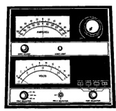
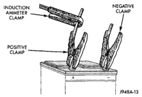
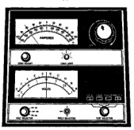

# DIAGNOSIS AND TESTING (Continued)

**WARNING:**
- **IF THE BATTERY SHOWS SIGNS OF FREEZING, LEAKING, LOOSE POSTS, OR LOW ELECTROLYTE LEVEL, DO NOT TEST, ASSIST-BOOST, OR CHARGE. THE BATTERY MAY ARC INTERNALLY AND EXPLODE. PERSONAL INJURY AND/OR VEHICLE DAMAGE MAY RESULT.**
- **EXPLOSIVE HYDROGEN GAS FORMS IN AND AROUND THE BATTERY. DO NOT SMOKE, USE FLAME, OR CREATE SPARKS NEAR THE BATTERY. PERSONAL INJURY AND/OR VEHICLE DAMAGE MAY RESULT.**
- **THE BATTERY CONTAINS SULFURIC ACID, WHICH IS POISONOUS AND CAUSTIC. AVOID CONTACT WITH THE SKIN, EYES, OR CLOTHING. IN THE EVENT OF CONTACT, FLUSH WITH WATER AND CALL A PHYSICIAN IMMEDIATELY. KEEP OUT OF THE REACH OF CHILDREN.**
- **IF THE BATTERY IS EQUIPPED WITH REMOVABLE CELL CAPS, BE CERTAIN THAT EACH OF THE CELL CAPS IS IN PLACE AND TIGHT BEFORE THE BATTERY IS RETURNED TO SERVICE. PERSONAL INJURY AND/OR VEHICLE DAMAGE MAY RESULT FROM LOOSE OR MISSING CELL CAPS.**

Before proceeding with this test, completely charge the battery. See Battery Charging in the Service Procedures section of this group for the proper charging procedures.

**NOTE:** Models equipped with the diesel engine option are equipped with two 12-volt batteries, connected in parallel (positive-to-positive/negative-to-negative). In order to ensure accurate diagnostic results, these batteries MUST be disconnected from each other, as well as from the vehicle electrical system, when being tested.

(1) Disconnect and isolate both battery cables, negative cable first. The battery top and posts should be clean.

(2) Connect a suitable volt-ammeter-load tester (Fig. 6) to the battery posts (Fig. 7). Refer to the operating instructions provided with the tester being used. Check the open-circuit voltage (no load) of the battery. See Open-Circuit Voltage Test in the Diagnosis and Testing section of this group for the procedures. The battery open-circuit voltage must be 12.4 volts or greater.

(3) Rotate the load control knob (carbon pile rheostat) to apply a 300 ampere load to the battery for fifteen seconds, then return the control knob to the Off position (Fig. 8). This will remove the surface charge from the battery.

*Fig. 6 Volt-Ammeter-Load Tester - Typical*

*Fig. 7 Volt-Ammeter-Load Tester Connections - Typical*

*Fig. 8 Remove Surface Charge from Battery - Typical*

(4) Allow the battery to stabilize to open-circuit voltage. It may take up to five minutes for the battery voltage to stabilize.

---
*8A_Battery - Page 9*
