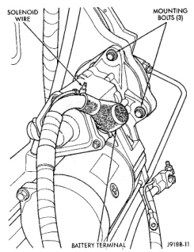
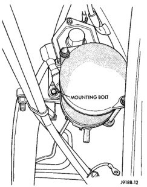
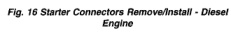

# REMOVAL AND INSTALLATION (Continued)

*Fig. 16 Starter Connectors Remove/Install - Diesel Engine*

(6) Remove hardware that secures the starter motor to the bellhousing (Fig. 16) and (Fig. 17).

(7) Remove the starter motor from the bellhousing.

(8) Reverse the removal procedures to install. Tighten the starter hardware as follows:
- Starter mounting bolts - 43 N·m (32 ft. lbs.)
- Solenoid wire harness terminal nut - 6 N·m (55 in. lbs.)
- Battery cable terminal nut - 14 N·m (120 in. lbs.).

*Fig. 17 Starter Mounting Bolt - Diesel Engine*

### STARTER RELAY

(1) Disconnect and isolate the battery negative cable(s).

(2) Remove the cover from the Power Distribution Center (PDC) (Fig. 18).

(3) Refer to the label on the PDC for starter relay identification and location.

(4) Unplug the starter relay from the PDC.

(5) Install the starter relay by aligning the relay terminals with the cavities in the PDC and pushing the relay firmly into place.

(6) Install the PDC cover.

(7) Connect the battery negative cable(s).

(8) Test the relay operation.

*Fig. 18 Power Distribution Center*

---
*8B_Starting_Systems - Page 10*
