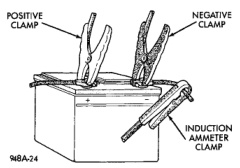
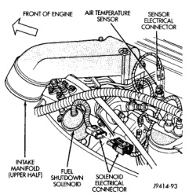
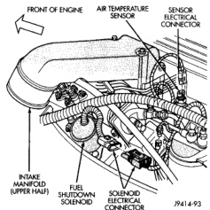
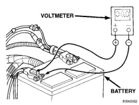

# DIAGNOSIS AND TESTING (Continued)

*Fig. 1 Volts-Amps Tester Connections - Typical*

*Fig. 2 Fuel Shutdown Solenoid Connector - Diesel Engine*

- To prevent the gasoline engine from starting, unplug the Automatic ShutDown (ASD) relay. The ASD relay is located in the Power Distribution Center (PDC). Refer to the PDC label for ASD relay identification and location. To prevent the diesel engine from starting, unplug the fuel shutdown solenoid wire harness connector (Fig. 3).

(1) Connect the positive lead of the voltmeter to the battery negative terminal post. Connect the negative lead of the voltmeter to the battery negative cable clamp (Fig. 4). Rotate and hold the ignition switch in the Start position. Observe the voltmeter. If voltage is detected, correct the poor contact between the cable clamp and the terminal post.

(2) Connect the positive lead of the voltmeter to the battery positive terminal post. Connect the negative lead of the voltmeter to the battery positive cable clamp (Fig. 5). Rotate and hold the ignition switch in the Start position. Observe the voltmeter. If voltage is detected, correct the poor contact between the cable clamp and the terminal post.

*Fig. 3 Fuel Shutdown Solenoid Connector - Diesel Engine*

*Fig. 4 Test Battery Negative Connection Resistance - Typical*

(3) Connect the voltmeter to measure between the battery positive terminal post and the starter solenoid battery terminal stud (Fig. 6). Rotate and hold the ignition switch in the Start position. Observe the voltmeter. If the reading is above 0.2 volt, clean and tighten the battery cable connection at the solenoid. Repeat the test. If the reading is still above 0.2 volt, replace the faulty battery positive cable.

---
*8B_Starting_Systems - Page 5*
