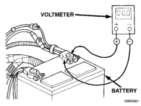
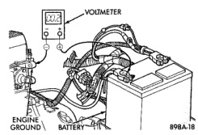
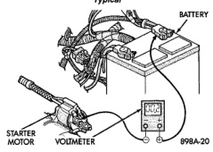
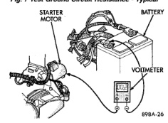

# DIAGNOSIS AND TESTING (Continued)

*Fig. 5 Test Battery Positive Connection Resistance - Typical*

*Fig. 6 Test Battery Positive Cable Resistance - Typical*

(4) Connect the voltmeter to measure between the battery negative terminal post and a good clean ground on the engine block (Fig. 7). Rotate and hold the ignition switch in the Start position. Observe the voltmeter. If the reading is above 0.2 volt, clean and tighten the battery negative cable attachment on the engine block. Repeat the test. If the reading is still above 0.2 volt, replace the faulty battery negative cable.

(5) Connect the positive lead of the voltmeter to the starter housing. Connect the negative lead of the voltmeter to the battery negative terminal post (Fig. 8). Rotate and hold the ignition switch in the Start position. Observe the voltmeter. If the reading is above 0.2 volt, correct the poor starter to engine block ground contact.

If the resistance tests detect no feed circuit problems, remove the starter from the vehicle and see Solenoid Test in the Diagnosis and Testing section of this group.

*Fig. 7 Test Ground Circuit Resistance - Typical*

*Fig. 8 Test Starter Ground - Typical*

### CONTROL CIRCUIT TEST

For circuit descriptions and diagrams, refer to 8W-21 - Starting System in Group 8W - Wiring Diagrams. The starter control circuit consists of:
- Battery
- Starter relay
- Starter solenoid
- Ignition switch
- Park/neutral position switch (automatic transmission)
- Clutch pedal position switch (manual transmission)
- Wire harness and connections.

Test procedures for these components should be performed in the order in which they are listed, as follows:

### SOLENOID TEST

Remove the starter from the vehicle. See Starter in the Removal and Installation section of this group for the procedures. Then proceed as follows:

(1) Remove the wire from the solenoid field coil terminal.

---
*8B_Starting_Systems - Page 6*
