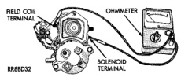
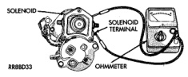
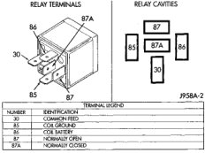

# DIAGNOSIS AND TESTING (Continued)

(2) Check for continuity between the solenoid terminal and the field coil terminal with a continuity tester (Fig. 9). There should be continuity. If OK, go to Step 3. If not OK, replace the faulty starter assembly.

*Fig. 9 Continuity Test Between Solenoid Terminal and Field Coil Terminal*

(3) Check for continuity between the solenoid terminal and the solenoid case (Fig. 10). There should be continuity. If OK, go to Step 4. If not OK, replace the faulty starter assembly.

*Fig. 10 Continuity Test Between Solenoid Terminal and Solenoid Case*

(4) Connect the solenoid field coil wire to the field coil terminal.

(5) Reinstall the starter. See Starter in the Removal and Installation section of this group for the procedures.

### RELAY TEST

The starter relay (Fig. 11) is located in the Power Distribution Center (PDC) in the engine compartment. Refer to the PDC label for starter relay identification and location.

Remove the starter relay from the PDC to perform the following tests. See Starter Relay in the Removal and Installation section of this group for the procedures.

(1) A relay in the de-energized position should have continuity between terminals 87A and 30, and no continuity between terminals 87 and 30. If OK, go to Step 2. If not OK, replace the faulty relay.

(2) Resistance between terminals 85 and 86 (electromagnet) should be 75 ± 5 ohms. If OK, go to Step 3. If not OK, replace the faulty relay.

(3) Connect a battery to terminals 85 and 86. There should now be continuity between terminals 30 and 87, and no continuity between terminals 87A and 30. If OK, see Relay Circuit Test in the Diagnosis and Testing section of this group. If not OK, replace the faulty relay.

*Fig. 11 Starter Relay*

### RELAY CIRCUIT TEST

(1) The relay common feed terminal cavity (30) is connected to battery voltage and should be hot at all times. If OK, go to Step 2. If not OK, repair the open circuit to the PDC fuse as required.

(2) The relay normally closed terminal (87A) is connected to terminal 30 in the de-energized position, but is not used for this application. Go to Step 3.

(3) The relay normally open terminal (87) is connected to the common feed terminal (30) in the energized position. This terminal supplies battery voltage to the starter solenoid field coils. There should be continuity between the cavity for relay terminal 87 and the starter solenoid terminal at all times. If OK, go to Step 4. If not OK, repair the open circuit to the starter solenoid as required.

(4) The coil battery terminal (86) is connected to the electromagnet in the relay. It is energized when the ignition switch is held in the Start position. On vehicles with a manual transmission, the clutch pedal must be fully depressed for this test. Check for battery voltage at the cavity for relay terminal 86 with the ignition switch in the Start position, and no voltage when the ignition switch is released to the On position. If OK, go to Step 5. If not OK with an automatic transmission, check for an open or short circuit to the ignition switch and repair, if required. If the circuit to the ignition switch is OK, see Ignition Switch Test in the Diagnosis and Testing section of this group. If not OK with a manual transmission, check the circuit between the relay and the clutch pedal position switch for an open or a short. If the circuit is OK, see Clutch Pedal Position Switch Test in the Diagnosis and Testing section of this group.

(5) The coil ground terminal (85) is connected to the electromagnet in the relay. On vehicles with an

---
*8B_Starting_Systems - Page 7*
