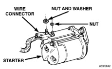
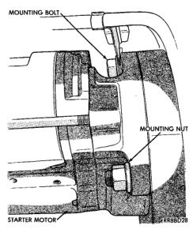
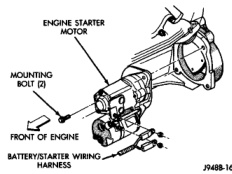
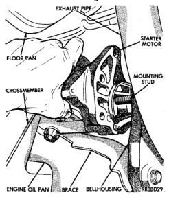

# REMOVAL AND INSTALLATION (Continued)

*Fig. 12 Starter Connector Remove/Install - V-6/V-8 Engine*

*Fig. 13 Starter Remove/Install - V-10 Engine*

(5) Move the starter towards the front of the vehicle until the starter gear housing nose clears the bellhousing. Then tilt the nose downwards and lower the starter past the exhaust pipe (Fig. 13) or (Fig. 15).

(6) Reverse the removal procedures to install. Tighten the starter hardware as follows:
- Starter mounting bolts to 68 N·m (50 ft. lbs.)
- Starter mounting nut - 68 N·m (50 ft. lbs.)
- Battery cable terminal nut - 14 N·m (120 in. lbs.)
- Solenoid wire harness terminal nut - 6 N·m (55 in. lbs.).

*Fig. 14 Starter Mounting Hardware Remove/Install - V-6/V-8 Engine*

*Fig. 15 Starter Remove/Install - V-6/V-8 Engine*

#### DIESEL ENGINE

(1) Disconnect and isolate both of the battery negative cables.

(2) Raise and support the vehicle.

(3) Pull back the protective rubber boot from the solenoid battery terminal far enough to access the battery cable wire harness connector (Fig. 16).

(4) Remove the nut that secures the battery cable wire harness connector to the solenoid battery terminal stud.

(5) Remove the nut that secures the solenoid wire harness connector to the solenoid terminal stud.

---
*8B_Starting_Systems - Page 9*
