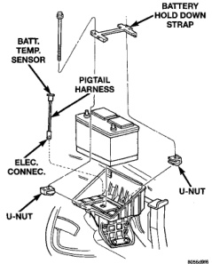

## DIAGNOSIS AND TESTING (Continued)

(3) Connect one end of a jumper wire to a good ground. Connect the other end of jumper wire to the generator field driver (-) terminal. The 2 field terminals (+ and -) are located on the back of the generator (Fig. 1) or (Fig. 2). To locate and identify the (-) terminal and circuit, refer to Group 8W, Wiring Diagrams. Another way to identify the (-) terminal is to start the engine and measure voltage at both field terminals. The (+) terminal will show battery voltage (12.5-14.5 volts). The (-) terminal will show 3-5 volts less than battery voltage.

**CAUTION: Do not connect the jumper ground wire to the generator field source (+) field terminal. Damage to electrical system components may result.**

Connecting the jumper wire will remove the voltage regulator circuitry from the test. It will also generate a Diagnostic Trouble Code (DTC).

(4) Start engine. **Immediately** after starting, reduce engine speed to idle. This will prevent any electrical accessory damage from high voltage.

(5) Adjust carbon pile rheostat (load) and engine speed in slow increments until a speed of 1250 rpm, and a voltmeter reading of 15 volts is obtained. Immediately record ammeter reading. Do not apply load to system longer than 15 seconds as damage to test equipment may result.

**CAUTION: When adjusting rheostat load, do not allow voltage to rise above 16 volts. Damage to the battery and electrical system components may result.**

(6) The ammeter reading must meet the Minimum Test Amps specifications as displayed in the Generator Ratings chart. This can be found in the Specifications section at the end of this group. A label stating a part reference number is attached to the generator case. On some engines this label may be located on the bottom of the case. Compare this reference number to the Generator Rating chart.

(7) Remove volt/amp tester.

(8) Remove jumper wire.

(9) Use the DRB scan tool to erase the DTC. Refer to the DRB screen for procedures.

### RESULTS

- If amp reading meets specifications in Test 2, generator is OK.

- If amp reading is less than specified in Test 2, and wire resistance (voltage drop) tests were OK, the generator should be replaced. Refer to Removal and Installation in this group for procedures.

- If Test 2 results were OK, but Test 1 results were not, the problem is in EVR circuitry. Refer to appropriate Powertrain Diagnostic Procedures manual for diagnosis.

### BATTERY TEMPERATURE SENSOR

To perform a complete test of this sensor and its circuitry, refer to the appropriate Powertrain Diagnostic Procedures manual. To test the sensor only, refer to the following:

(1) The sensor is located under the battery and is attached (snapped into) the battery tray (Fig. 3). On models equipped with a diesel engine (dual batteries), only one sensor is used. Location is under battery on drivers side of vehicle. A two-wire pigtail harness is attached directly to the sensor. The opposite end of this harness connects the sensor to the engine wiring harness.

*Fig. 3 Battery Temperature Sensor Location*
- Batt. Temp. Sensor
- Pigtail Harness
- Elec. Connec.
- Battery Hold Down Strap
- U-Nut

(2) Disconnect the two-wire pigtail harness from the engine harness.

(3) Attach ohmmeter leads to the wire terminals of the pigtail harness.

(4) At room temperature of 25° C (75-80° F), an ohmmeter reading of 9,000 (9K) to 11,000 (11K) ohms should be observed.

(5) If reading is above or below the specification, replace the sensor.

(6) Refer to the Removal and Installation section for procedures.
