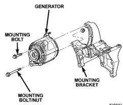
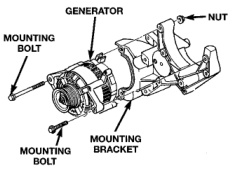

## DIAGNOSIS AND TESTING (Continued)

### ON-BOARD DIAGNOSTIC TEST FOR CHARGING SYSTEM

The Powertrain Control Module (PCM) monitors critical input and output circuits of the charging system, making sure they are operational. A Diagnostic Trouble Code (DTC) is assigned to each input and output circuit monitored by the On-Board Diagnostic (OBD) system. Some circuits are checked continuously and some are checked only under certain conditions.

For DTC information, refer to Diagnostic Trouble Codes in Group 25, Emission Control System. This will include a complete list of DTC's including DTC's for the charging system.

## REMOVAL AND INSTALLATION

### GENERATOR

#### REMOVAL

**WARNING: DISCONNECT NEGATIVE CABLE FROM BATTERY BEFORE REMOVING BATTERY OUTPUT WIRE (B+ WIRE) FROM GENERATOR. FAILURE TO DO SO CAN RESULT IN INJURY OR DAMAGE TO ELECTRICAL SYSTEM.**

(1) Disconnect negative battery cable at battery. Diesel Engines: Disconnect both negative battery cables at both batteries.

(2) Remove generator drive belt. Refer to Group 7, Cooling System for procedure.

(3) Remove generator pivot and mounting bolts/nut (Fig. 4) or (Fig. 5). The diesel engine uses a bolt at top mounting and a bolt/nut at lower mounting. Position generator for access to wire connectors.

(4) Remove nuts from harness holddown, battery terminal, ground terminal and 2 field terminals. Remove wire connectors. A typical generator wiring harness is shown in (Fig. 6). Wiring harness routing as shown may be slightly different depending on vehicle model and/or engine. Refer to Group 8W, Wiring Diagrams for additional information.

(5) Remove generator from vehicle.

*Fig. 4 Remove/Install Generator—3.9L/5.2L/5.9L Engines*
- Generator
- Mounting Bolt
- Mounting Bracket
- Mounting Bolt/Nut

#### INSTALLATION

(1) Position generator to engine and install wiring to rear of generator. Tighten all wiring fasteners as follows:

- Battery terminal nut—8.5 N·m (75 in. lbs.)
- Ground terminal nut—8.5 N·m (75 in. lbs.)
- Harness holddown nut—8.5 N·m (75 in. lbs.)
- Field terminal nuts—2.8 N·m (25 in. lbs.)

(2) Install generator mounting fasteners and tighten as follows:

*Fig. 5 Remove/Install Generator—8.0L Engine*
- Generator
- Nut
- Mounting Bolt
- Mounting Bracket
- Mounting Bolt

- Generator mounting bolt—All gas powered engines—41 N·m (30 ft. lbs.)
- Generator pivot bolt/nut—All gas powered engines—41 N·m (30 ft. lbs.)
- Generator mounting bolt—Diesel powered engines—54 N·m (40 ft. lbs.)
- Generator pivot bolt/nut—Diesel powered engines—54 N·m (40 ft. lbs.)

**CAUTION: Never force a belt over a pulley rim using a screwdriver. The synthetic fiber of the belt can be damaged.**
