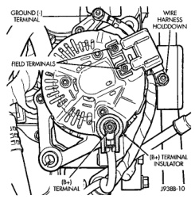
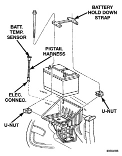

## REMOVAL AND INSTALLATION (Continued)

*Fig. 6 Remove/Install Generator Connectors—Typical*
- Ground (-) Terminal
- Field Terminals
- (B+) Terminal
- (B+) Terminal Insulator
- Wire Harness Holddown

**CAUTION: When installing a serpentine accessory drive belt, the belt MUST be routed correctly. The water pump will be rotating in the wrong direction if the belt is installed incorrectly, causing the engine to overheat. Refer to belt routing label in engine compartment, or refer to Belt Schematics in Group 7, Cooling System.**

(3) Install generator drive belt. Refer to Group 7, Cooling System for procedure.

(4) Install negative battery cable(s) to battery(s).

### BATTERY TEMPERATURE SENSOR

The battery temperature sensor is located under the vehicle battery (Fig. 7) and is attached (snapped into) a mounting hole on battery tray. On models equipped with a diesel engine (dual batteries), only one sensor is used. The sensor is located under the battery on drivers side of vehicle.

*Fig. 7 Battery Temperature Sensor Location*
- Batt. Temp. Sensor
- Pigtail Harness
- Elec. Connec.
- U-Nut
- Battery Hold Down Strap

#### REMOVAL

(1) Remove battery. Refer to Group 8A, Battery for procedures.

(2) Disconnect sensor pigtail harness from engine wire harness.

(3) Pry sensor straight up from battery tray mounting hole.

#### INSTALLATION

(1) Feed pigtail harness through mounting hole in top of battery tray and press sensor into top of tray (snaps in).

(2) Connect pigtail harness.

(3) Install battery. Refer to Group 8A, Battery for procedures.
