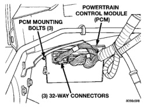
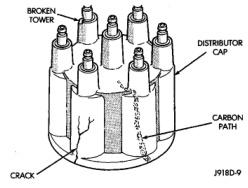

# 8D - 10 IGNITION SYSTEM BR

## DIAGNOSIS AND TESTING (Continued)

### IGNITION COIL RESISTANCE—8.0L V-10 ENGINE (Fig. 18)

| Specification | Value | Notes |
|---------------|-------|-------|
| Primary Resistance | 0.53 to 0.65 Ohms | Test across the primary connector. Refer to text for test procedures. |
| Secondary Resistance | 10.9 to 14.7K Ohms | Test across the individual coil towers. Refer to text for test procedures. |

*Fig. 19 Ignition Coil Resistance—8.0L V-10 Engine]*

(4) Determine that sufficient battery voltage (12.4 volts) is present for the starting and ignition systems.

(5) Crank the engine for 5 seconds while monitoring the voltage at the coil positive terminal:

- If the voltage remains near zero during the entire period of cranking, refer to On-Board Diagnostics in Group 14, Fuel Systems. Check the Powertrain Control Module (PCM) and auto shutdown relay.

- If voltage is at or near battery voltage and drops to zero after 1-2 seconds of cranking, check the powertrain control module circuit. Refer to On-Board Diagnostics in Group 14, Fuel Systems.

- If voltage remains at or near battery voltage during the entire 5 seconds, turn the key off. Remove the three 32-way connectors (Fig. 19) from the PCM. Check 32-way connectors for any spread terminals or corrosion.

*Fig. 20 PCM and Three 32-Way Connectors]*

(6) Remove test lead from the coil positive terminal. Connect an 18 gauge jumper wire between the battery positive terminal and the coil positive terminal.

(7) Make the special jumper shown in (Fig. 20). Using the jumper, momentarily ground the ignition coil driver circuit at the PCM connector (cavity A-7). For cavity/terminal location of this circuit, refer to Group 8W, Wiring. A spark should be generated at the coil cable when the ground is removed.

[Figure: Fig. 20 Special Jumper Ground-to-Coil Negative Terminal]

(8) If spark is generated, replace the PCM.

(9) If spark is not seen, use the special jumper to ground the coil negative terminal directly.

(10) If spark is produced, repair wiring harness for an open condition.

(11) If spark is not produced, replace the ignition coil.

### DISTRIBUTOR CAP—3.9L/5.2L/5.9L ENGINES

Remove the distributor cap and wipe it clean with a dry lint free cloth. Visually inspect the cap for cracks, carbon paths, broken towers or damaged rotor button (Fig. 21) or (Fig. 22). Also check for white deposits on the inside (caused by condensation entering the cap through cracks). Replace any cap that displays charred or eroded terminals. The machined surface of a terminal end (faces toward rotor) will indicate some evidence of erosion from normal operation. Examine the terminal ends for evidence of mechanical interference with the rotor tip.

[Figure: Fig. 21 Cap Inspection—External—Typical]

### DISTRIBUTOR ROTOR—3.9L/5.2L/5.9L ENGINES

Visually inspect the rotor (Fig. 23) for cracks, evidence of corrosion or the effects of arcing on the
