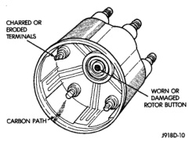
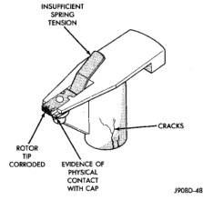
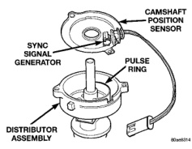

# IGNITION SYSTEM 8D - 11

## DIAGNOSIS AND TESTING (Continued)

*Fig. 22 Cap Inspection—Internal—Typical]*

metal tip. Also check for evidence of mechanical interference with the cap. Some charring is normal on the end of the metal tip. The silicone-dielectric-varnish-compound applied to the rotor tip for radio interference noise suppression, will appear charred. This is normal. **Do not remove the charred compound.** Test the spring for insufficient tension. Replace a rotor that displays any of these adverse conditions.

*Fig. 23 Rotor Inspection—Typical]*

### IGNITION TIMING

**NOTE:** Base (initial) ignition timing is NOT adjustable on any engine. On 3.9L/5.2L/5.9L engines, do not attempt to adjust ignition timing by rotating the distributor.

All ignition timing functions are controlled by the Powertrain Control Module (PCM). The DRB scan tool may be used to verify base timing and electronic timing advance. Refer to the appropriate Powertrain Diagnostics Procedures service manual for operation of the DRB Scan Tool.

**Fuel synchronization** can be verified and set by rotating the distributor. Refer to the Distributor Removal/Installation section of this group. See Checking Distributor Position. This operation can be performed on 3.9L/5.2L/5.9L engines only.

### MAP SENSOR

For an operational description, diagnosis or removal/installation procedures, refer to Group 14, Fuel Systems.

### CRANKSHAFT POSITION SENSOR

To perform a complete test of this sensor and its circuitry, refer to the DRB scan tool. Also refer to the appropriate Powertrain Diagnostics Procedures manual.

### CAMSHAFT POSITION SENSOR—3.9L/5.2L/5.9L ENGINES

The camshaft position sensor is located in the distributor (Fig. 24) on all engines.

*Fig. 24 Camshaft Position Sensor—3.9/5.2/5.9L Engines—Typical]*

To perform a complete test of this sensor and its circuitry, refer to the appropriate Powertrain Diagnostics Procedures service manual. To test the sensor only, refer to the following:

For this test, an **analog (non-digital) voltmeter is needed.** Do not remove the distributor connector from the distributor. Using small paper clips, insert them into the backside of the distributor wire harness connector to make contact with the terminals. Be sure that the connector is not damaged

*Source: 8D Ignition System, Page 11*
