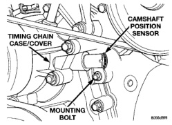
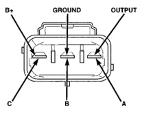

# 8D - 12 IGNITION SYSTEM

## DIAGNOSIS AND TESTING (Continued)

when inserting the paper clips. Attach voltmeter leads to these paper clips.

(1) Connect the positive (+) voltmeter lead into the sensor output wire. This is done at the distributor wire harness connector. For wire identification, refer to Group 8W, Wiring Diagrams.

(2) Connect the negative (-) voltmeter lead into the ground wire. For wire identification, refer to Group 8W, Wiring Diagrams.

(3) Set the voltmeter to the 15 Volt DC scale.

(4) Remove distributor cap from distributor (two screws). Rotate (crank) the engine until the distributor rotor is pointed towards the rear of vehicle. The movable pulse ring should now be within the sensor pickup.

(5) Turn ignition key to ON position. Voltmeter should read approximately 5.0 volts.

(6) If voltage is not present, check the voltmeter leads for a good connection.

(7) If voltage is still not present, check for voltage at the supply wire. For wire identification, refer to Group 8W, Wiring Diagrams.

(8) If 5 volts is not present at supply wire, check for voltage at PCM 32-way connector (cavity A-17). Refer to Group 8W, Wiring for location of connector/terminal. Leave the PCM connector connected for this test.

(9) If voltage is still not present, perform vehicle test using the DRB scan tool.

(10) If voltage is present at cavity A-17, but not at the supply wire:

- (a) Check continuity between the supply wire. This is checked between the distributor connector and cavity A-17 at the PCM. If continuity is not present, repair the harness as necessary.

- (b) Check for continuity between the camshaft position sensor output wire and cavity A-18 at the PCM. If continuity is not present, repair the harness as necessary.

- (c) Check for continuity between the ground circuit wire at the distributor connector and ground. If continuity is not present, repair the harness as necessary.

(11) While observing the voltmeter, crank the engine with ignition switch. The voltmeter needle should fluctuate between 0 and 5 volts while the engine is cranking. This verifies that the camshaft position sensor in the distributor is operating properly and a sync pulse signal is being generated.

If sync pulse signal is not present, replacement of the camshaft position sensor is necessary.

### CAMSHAFT POSITION SENSOR TEST—8.0L V-10 ENGINE

The camshaft position sensor is located in the timing chain case/cover on the left-front side of the engine (Fig. 25).

*Fig. 25 Camshaft Position Sensor—8.0L V-10 Engine]*

To perform a complete test of this sensor and its circuitry, refer to the DRB scan tool. Also refer to the appropriate Powertrain Diagnostics Procedures manual. To test the sensor only, refer to the following:

(1) Disconnect the sensor connector at sensor.

(2) Place an ohmmeter across terminals B and C (Fig. 26). **Ohmmeter should be set to 1K-to-10K scale for this test.** The meter reading should be open (no resistance). Replace sensor if a low resistance is indicated.

*Fig. 26 Sensor Connector—8.0L Engine]*

*Source: 8D Ignition System, Page 12*
