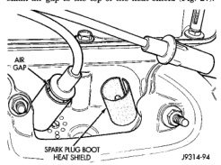

# IGNITION SYSTEM 8D - 13

## DIAGNOSIS AND TESTING (Continued)

### ENGINE COOLANT TEMPERATURE SENSOR

For an operational description, diagnosis and removal/installation procedures, refer to Group 14, Fuel System.

### INTAKE MANIFOLD AIR TEMPERATURE SENSOR

For an operational description, diagnosis and removal/installation procedures, refer to Group 14, Fuel System.

### SPARK PLUG CABLES

Check the spark plug cable connections for good contact at the coil(s), distributor cap towers, and spark plugs. Terminals should be fully seated. The insulators should be in good condition and should fit tightly on the coil, distributor and spark plugs. Spark plug cables with insulators that are cracked or torn must be replaced.

Clean high voltage ignition cables with a cloth moistened with a non-flammable solvent. Wipe the cables dry. Check for brittle or cracked insulation.

On 3.9L/5.2L/5.9L engines, spark plug cable heat shields are pressed into the cylinder head to surround each spark plug cable boot and spark plug (Fig. 27). These shields protect the spark plug boots from damage (due to intense engine heat generated by the exhaust manifolds) and should not be removed. After the spark plug cable has been installed, the lip of the cable boot should have a small air gap to the top of the heat shield (Fig. 27).

*Fig. 27 Heat Shields—3.9L/5.2L/5.9L Engines]*

### TESTING

When testing secondary cables for damage with an oscilloscope, follow the instructions of the equipment manufacturer.

If an oscilloscope is not available, spark plug cables may be tested as follows:

**CAUTION: Do not leave any one spark plug cable disconnected for longer than necessary during testing. This may cause possible heat damage to the catalytic converter. Total test time must not exceed ten minutes.**

With the engine running, remove spark plug cable from spark plug (one at a time) and hold next to a good engine ground. If the cable and spark plug are in good condition, the engine rpm should drop and the engine will run poorly. If engine rpm does not drop, the cable and/or spark plug may not be operating properly and should be replaced. Also check engine cylinder compression.

With the engine not running, connect one end of a test probe to a good ground. Start the engine and run the other end of the test probe along the entire length of all spark plug cables. If cables are cracked or punctured, there will be a noticeable spark jump from the damaged area to the test probe. The cable running from the ignition coil to the distributor cap can be checked in the same manner. Cracked, damaged or faulty cables should be replaced with resistance type cable. This can be identified by the words ELECTRONIC SUPPRESSION printed on the cable jacket.

Use an ohmmeter to test for open circuits, excessive resistance or loose terminals. If equipped, remove the distributor cap from the distributor. **Do not remove cables from cap.** Remove cable from spark plug. Connect ohmmeter to spark plug terminal end of cable and to corresponding electrode in distributor cap. Resistance should be 250 to 1000 Ohms per inch of cable. If not, remove cable from distributor cap tower and connect ohmmeter to the terminal ends of cable. If resistance is not within specifications as found in the SPARK PLUG CABLE RESISTANCE chart, replace the cable. Test all spark plug cables in this manner.

### SPARK PLUG CABLE RESISTANCE

| MINIMUM | MAXIMUM |
|---------|---------|
| 250 Ohms Per Inch | 1000 Ohms Per Inch |
| 3000 Ohms Per Foot | 12,000 Ohms Per Foot |

To test ignition coil-to-distributor cap cable, do not remove the cable from the cap. Connect ohmmeter to rotor button (center contact) of distributor cap and terminal at ignition coil end of cable. If resistance is not within specifications as found in the Spark Plug Cable Resistance chart, remove the cable from the distributor cap. Connect the ohmmeter to the terminal ends of the cable. If resistance is not within specifications as found in the Spark Plug Cable Resistance chart, replace the cable. Inspect the ignition coil tower for cracks, burns or corrosion.

*Source: 8D Ignition System, Page 13*
