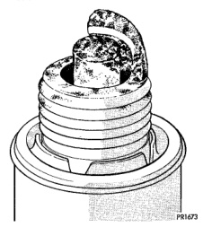
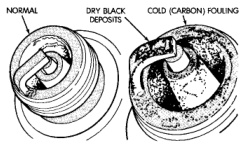

# 8D - 14 IGNITION SYSTEM

## DIAGNOSIS AND TESTING (Continued)

### SPARK PLUG CONDITIONS

#### NORMAL OPERATING

The few deposits present on the spark plug will probably be light tan or slightly gray in color. This is evident with most grades of commercial gasoline (Fig. 28). There will not be evidence of electrode burning. Gap growth will not average more than approximately 0.025 mm (.001 in) per 1600 km (1000 miles) of operation. Spark plugs that have normal wear can usually be cleaned, have the electrodes filed, have the gap set and then be installed.

*Fig. 28 Normal Operation and Cold (Carbon) Fouling]*

Some fuel refiners in several areas of the United States have introduced a manganese additive (MMT) for unleaded fuel. During combustion, fuel with MMT causes the entire tip of the spark plug to be coated with a rust colored deposit. This rust color can be misdiagnosed as being caused by coolant in the combustion chamber. Spark plug performance is not affected by MMT deposits.

#### COLD FOULING/CARBON FOULING

Cold fouling is sometimes referred to as carbon fouling. The deposits that cause cold fouling are basically carbon (Fig. 28). A dry, black deposit on one or two plugs in a set may be caused by sticking valves or defective spark plug cables. Cold (carbon) fouling of the entire set of spark plugs may be caused by a clogged air cleaner element or repeated short operating times (short trips).

#### WET FOULING OR GAS FOULING

A spark plug coated with excessive wet fuel or oil is wet fouled. In older engines, worn piston rings, leaking valve guide seals or excessive cylinder wear can cause wet fouling. In new or recently overhauled engines, wet fouling may occur before break-in (normal oil control) is achieved. This condition can usually be resolved by cleaning and reinstalling the fouled plugs.

#### OIL OR ASH ENCRUSTED

If one or more spark plugs are oil or oil ash encrusted (Fig. 29), evaluate engine condition for the cause of oil entry into that particular combustion chamber.

*Fig. 29 Oil or Ash Encrusted]*

#### ELECTRODE GAP BRIDGING

Electrode gap bridging may be traced to loose deposits in the combustion chamber. These deposits accumulate on the spark plugs during continuous stop-and-go driving. When the engine is suddenly subjected to a high torque load, deposits partially liquefy and bridge the gap between electrodes (Fig. 30). This short circuits the electrodes. Spark plugs with electrode gap bridging can be cleaned using standard procedures.

#### SCAVENGER DEPOSITS

Fuel scavenger deposits may be either white or yellow (Fig. 31). They may appear to be harmful, but this is a normal condition caused by chemical additives in certain fuels. These additives are designed to change the chemical nature of deposits and decrease spark plug misfire tendencies. Notice that accumulation on the ground electrode and shell area may be heavy, but the deposits are easily removed. Spark plugs with scavenger deposits can be considered normal in condition and can be cleaned using standard procedures.

*Source: 8D Ignition System, Page 14*
