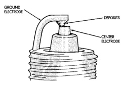
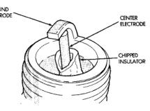
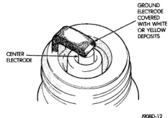
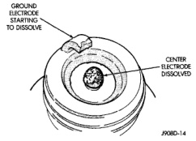

# IGNITION SYSTEM 8D - 15

## DIAGNOSIS AND TESTING (Continued)

*Fig. 30 Electrode Gap Bridging]*

*Fig. 31 Scavenger Deposits]*

#### CHIPPED ELECTRODE INSULATOR

A chipped electrode insulator usually results from bending the center electrode while adjusting the spark plug electrode gap. Under certain conditions, severe detonation can also separate the insulator from the center electrode (Fig. 32). Spark plugs with this condition must be replaced.

*Fig. 32 Chipped Electrode Insulator]*

#### PREIGNITION DAMAGE

Preignition damage is usually caused by excessive combustion chamber temperature. The center electrode dissolves first and the ground electrode dissolves somewhat later (Fig. 33). Insulators appear relatively deposit free. Determine if the spark plug has the correct heat range rating for the engine. Determine if ignition timing is over advanced or if other operating conditions are causing engine overheating. (The heat range rating refers to the operating temperature of a particular type spark plug. Spark plugs are designed to operate within specific temperature ranges. This depends upon the thickness and length of the center electrode's porcelain insulator.)

*Fig. 33 Preignition Damage]*

#### SPARK PLUG OVERHEATING

Overheating is indicated by a white or gray center electrode insulator that also appears blistered (Fig. 34). The increase in electrode gap will be considerably in excess of 0.001 inch per 1000 miles of operation. This suggests that a plug with a cooler heat range rating should be used. Over advanced ignition timing, detonation and cooling system malfunctions can also cause spark plug overheating.

## REMOVAL AND INSTALLATION

### SPARK PLUG CABLES

**CAUTION: When disconnecting a high voltage cable from a spark plug or from the distributor cap, twist the rubber boot slightly (1/2 turn) to break it loose (Fig. 35). Grasp the boot (not the cable) and pull it off with a steady, even force.**

*Source: 8D Ignition System, Page 15*
