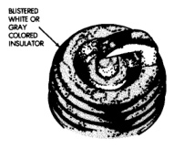
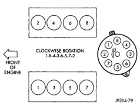
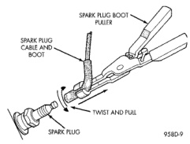
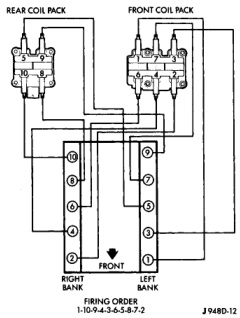
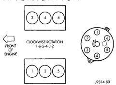

# 8D - 16 IGNITION SYSTEM

## REMOVAL AND INSTALLATION (Continued)

*Fig. 34 Spark Plug Overheating]*

*Fig. 35 Cable Removal]*

Install cables into the proper engine cylinder firing order (Fig. 36), (Fig. 37) or (Fig. 38).

*Fig. 36 Engine Firing Order—3.9L V-6 Engine]*

When replacing the spark plug and coil cables, route the cables correctly and secure in the proper

*Fig. 37 Engine Firing Order—5.2L/5.9L V-8 Engines]*

*Fig. 38 Spark Plug Cable Order—8.0L V-10 Engine]*

retainers. Failure to route the cables properly can cause the radio to reproduce ignition noise. It could also cause cross ignition of the plugs or short circuit the cables to ground.

When installing new cables, make sure a positive connection is made. A snap should be felt when a good connection is made between the plug cable and the distributor cap tower.

*Source: 8D Ignition System, Page 16*
