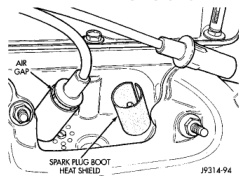
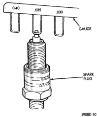

# IGNITION SYSTEM 8D - 17

## REMOVAL AND INSTALLATION (Continued)

### SPARK PLUGS

On 3.9L/5.2L/5.9L engines, spark plug cable heat shields are pressed into the cylinder head to surround each cable boot and spark plug (Fig. 39).

*Fig. 39 Heat Shields—3.9L/5.2L/5.9L Engines]*

If removal of the heat shield(s) is necessary, remove the spark plug cable and compress the sides of shield for removal. Each shield is slotted to allow for compression and removal. To install the shields, align shield to machined opening in cylinder head and tap into place with a block of wood.

#### PLUG REMOVAL

(1) Always remove spark plug or ignition coil cables by grasping at the cable boot (Fig. 35). Turn the cable boot 1/2 turn and pull straight back in a steady motion. Never pull directly on the cable. Internal damage to cable will result.

(2) Prior to removing the spark plug, spray compressed air around the spark plug hole and the area around the spark plug. This will help prevent foreign material from entering the combustion chamber.

(3) Remove the spark plug using a quality socket with a rubber or foam insert.

(4) Inspect the spark plug condition. Refer to Spark Plug Condition in the Diagnostics and Testing section of this group.

#### PLUG CLEANING

The plugs may be cleaned using commercially available spark plug cleaning equipment. After cleaning, file the center electrode flat with a small point file or jewelers file before adjusting gap.

**CAUTION: Never use a motorized wire wheel brush to clean the spark plugs. Metallic deposits will remain on the spark plug insulator and will cause plug misfire.**

#### PLUG GAP ADJUSTMENT

Check the spark plug gap with a gap gauge tool. If the gap is not correct, adjust it by bending the ground electrode (Fig. 40). **Never attempt to adjust the gap by bending the center electrode.**

*Fig. 40 Setting Spark Plug Gap—Typical]*

#### SPARK PLUG GAP

- **3.9L/5.2L/5.9L Engines:** 1.01 mm (.040 in).
- **8.0L Engine:** 1.14 mm (.045 in).

#### PLUG INSTALLATION

Special care should be taken when installing spark plugs into the cylinder head spark plug wells. Be sure the plugs do not drop into the plug wells as electrodes can be damaged.

Always tighten spark plugs to the specified torque. Over tightening can cause distortion resulting in a change in the spark plug gap or a cracked porcelain insulator.

When replacing the spark plug and ignition coil cables, route the cables correctly and secure them in the appropriate retainers. Failure to route the cables properly can cause the radio to reproduce ignition noise. It could cause cross ignition of the spark plugs or short circuit the cables to ground.

(1) Start the spark plug into the cylinder head by hand to avoid cross threading.

(2) Tighten spark plugs to 35-41 N-m (26-30 ft. lbs.) torque.

(3) Install spark plug cables over spark plugs.

### IGNITION COIL—3.9L/5.2L/5.9L ENGINES

The ignition coil is an epoxy filled type. If the coil is replaced, it must be replaced with the same type.

*Source: 8D Ignition System, Page 17*
