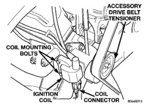
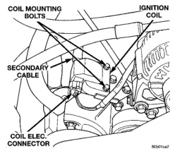
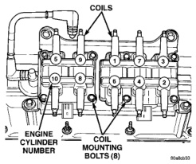

# 8D - 18 IGNITION SYSTEM

## REMOVAL AND INSTALLATION (Continued)

### REMOVAL

**3.9L V-6 or 5.2/5.9L V-8 LDC-Gas Engines:** The coil is mounted to a bracket that is bolted to the front of the right engine cylinder head (Fig. 41). This bracket is mounted on top of the automatic belt tensioner bracket using common bolts.

**5.9L V-8 HDC-Gas Engine:** The coil is mounted to a bracket that is bolted to the air injection pump (AIR pump) mounting bracket (Fig. 42).

*Fig. 41 Ignition Coil—3.9L V-6 or 5.2/5.9L V-8 LDC-Gas Engines]*

*Fig. 42 Ignition Coil—5.9L V-8 HDC-Gas Engine]*

(1) Disconnect the primary wiring from the ignition coil.

(2) Disconnect the secondary spark plug cable from the ignition coil.

**WARNING: 3.9L V-6 OR 5.2/5.9L V-8 LDC-GAS ENGINES: DO NOT REMOVE THE COIL MOUNTING BRACKET-TO-CYLINDER HEAD MOUNTING BOLTS.**

**THE COIL MOUNTING BRACKET IS UNDER ACCESSORY DRIVE BELT TENSION. IF THIS BRACKET IS TO BE REMOVED FOR ANY REASON, ALL BELT TENSION MUST FIRST BE RELIEVED. REFER TO THE BELT SECTION OF GROUP 7, COOLING SYSTEM.**

(3) Remove ignition coil from coil mounting bracket (two bolts).

### INSTALLATION

(1) Install the ignition coil to coil bracket. If nuts and bolts are used to secure coil to coil bracket, tighten to 11 N-m (100 in. lbs.) torque. If the coil mounting bracket has been tapped for coil mounting bolts, tighten bolts to 5 N-m (50 in. lbs.) torque.

(2) Connect all wiring to ignition coil.

### IGNITION COIL PACKS—8.0L V-10 ENGINE

Two separate coil packs containing a total of five independent coils are attached to a common mounting bracket located above the right engine valve cover (Fig. 43). The front and rear coil packs can be serviced separately.

*Fig. 43 Ignition Coil Packs—8.0L V-10 Engine]*

### REMOVAL

(1) Remove the secondary spark plug cables from the coil packs. Note position of cables before removal.

(2) Disconnect the primary wiring harness connectors at coil packs.

(3) Remove the four (4) coil pack-to-coil mounting bracket bolts for the coil pack being serviced (Fig. 43).

(4) Remove coil(s) from mounting bracket.

*Source: 8D Ignition System, Page 18*
