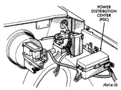
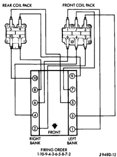
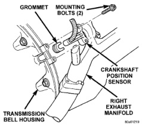

# IGNITION SYSTEM 8D - 19

## REMOVAL AND INSTALLATION (Continued)

### INSTALLATION

(1) Position coil packs to mounting bracket (primary wiring connectors face downward).

(2) Install coil pack mounting bolts. Tighten bolts to 10 N-m (90 in. lbs.) torque.

(3) Install coil pack-to-engine mounting bracket (if necessary).

(4) Connect primary wiring connectors to coil packs (four wire connector to front coil pack and three wire connector to rear coil pack).

(5) Connect secondary spark plug cables to coil packs. Refer to (Fig. 44) for correct cable order.

*Fig. 44 Spark Plug Cable Order—8.0L V-10 Engine]*

### AUTOMATIC SHUTDOWN (ASD) RELAY

The Automatic Shutdown (ASD) relay is located in the Power Distribution Center (PDC). The PDC is located in the engine compartment (Fig. 45). Refer to label on PDC cover for relay location.

#### REMOVAL

(1) Remove the PDC cover.

(2) Remove the relay by lifting straight up.

#### INSTALLATION

(1) Check condition of relay terminals at PDC for corrosion or damage. Also check the heights of relay

*Fig. 45 Power Distribution Center]*

terminal pins at PDC. Pin height should be same for all pins. Repair as necessary before installing relay.

(2) Push the relay into the connector.

(3) Install the relay cover.

### CRANKSHAFT POSITION SENSOR—3.9L/5.2L/5.9L ENGINES

#### REMOVAL

The sensor is bolted to the top of the cylinder block near the rear of right cylinder head (Fig. 46).

*Fig. 46 Crankshaft Position Sensor]*

(1) Remove the air cleaner intake tube.

(2) Disconnect crankshaft position sensor pigtail harness from main wiring harness.

(3) Remove two sensor (recessed hex head) mounting bolts (Fig. 46).

(4) Remove sensor from engine.

*Source: 8D Ignition System, Page 19*
