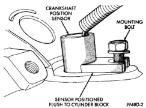
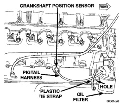
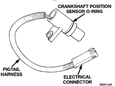

# 8D - 20 IGNITION SYSTEM

## REMOVAL AND INSTALLATION (Continued)

### INSTALLATION

(1) Position crankshaft position sensor to engine.

(2) Install mounting bolts and tighten to 8 N-m (70 in. lbs.) torque.

(3) Connect main harness electrical connector to sensor.

(4) Install air cleaner tube.

### CRANKSHAFT POSITION SENSOR—8.0L V-10 ENGINE

The crankshaft position sensor is located on the right-lower side of the cylinder block, forward of the right engine mount, just above the oil pan rail (Fig. 47).

*Fig. 47 Crankshaft Position Sensor Location—8.0L V-10 Engine]*

### REMOVAL

(1) Raise and support vehicle.

(2) Disconnect sensor pigtail harness from main engine wiring harness.

(3) Remove sensor mounting bolt (Fig. 48).

(4) Cut plastic tie strap (Fig. 47) securing sensor pigtail harness to side of engine block.

(5) Carefully pry sensor from cylinder block in a rocking action with two small screwdrivers.

(6) Remove sensor from vehicle.

(7) Check condition of sensor o-ring (Fig. 49).

### INSTALLATION

(1) Apply a small amount of engine oil to sensor o-ring (Fig. 49).

(2) Install sensor into cylinder block with a slight rocking action. Do not twist sensor into position as damage to o-ring may result.

**CAUTION: Before tightening sensor mounting bolt, be sure sensor is completely flush to cylinder block**

*Fig. 48 Sensor Removal/Installation—8.0L V-10 Engine]*

*Fig. 49 Sensor O-Ring—8.0L V-10 Engine]*

(Fig. 48). If sensor is not flush, damage to sensor mounting tang may result.

(3) Install mounting bolt and tighten to 8 N-m (70 in. lbs.) torque.

(4) Connect sensor pigtail harness to main engine wiring harness.

(5) Install new plastic tie strap (Fig. 47) to secure sensor pigtail harness to side of engine block. Thread tie strap through casting hole on cylinder block.

### CAMSHAFT POSITION SENSOR—3.9L/5.2L/5.9L ENGINES

The camshaft position sensor is located in the distributor (Fig. 50).

### REMOVAL

Distributor removal is not necessary to remove camshaft position sensor.

(1) Remove air cleaner assembly.

(2) Disconnect negative cable from battery.
