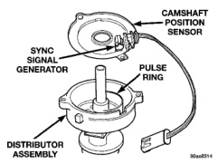
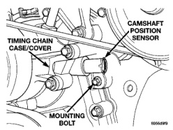
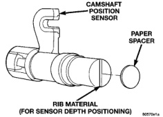

# 8D - 21 IGNITION SYSTEM

## REMOVAL AND INSTALLATION (Continued)

*Fig. 50 Camshaft Position Sensor—Typical]*

(3) Remove distributor cap from distributor (two screws).

(4) Disconnect camshaft position sensor wiring harness from main engine wiring harness.

(5) Remove distributor rotor from distributor shaft.

(6) Lift the camshaft position sensor assembly from the distributor housing (Fig. 50).

### INSTALLATION

(1) Install camshaft position sensor to distributor. Align sensor into notch on distributor housing.

(2) Connect wiring harness.

(3) Install rotor.

(4) Install distributor cap. Tighten mounting screws.

(5) Install air cleaner assembly.

### CAMSHAFT POSITION SENSOR—8.0L V-10 ENGINE

The camshaft position sensor is located on the timing chain case/cover on the left-front side of the engine (Fig. 51).

A thin plastic rib is molded into the face of the sensor (Fig. 52) to position the depth of sensor to the upper cam gear (sprocket). This rib can be found on both the new replacement sensors and sensors that were originally installed to the engine. The first time the engine has been operated, part of this rib may be sheared (ground) off. Depending on parts tolerances, some of the rib material may still be observed after removal.

Refer to either of the following procedures, Sensor Removal—Replacing Old Sensor With Original, or Sensor Removal—Replacing With New Sensor:

### SENSOR REMOVAL—REPLACING OLD SENSOR WITH ORIGINAL

If the original camshaft position sensor is to be removed and installed, such as when servicing the

*Fig. 51 Camshaft Position Sensor Location—8.0L V-10 Engine]*

*Fig. 52 Sensor Depth Positioning Rib—8.0L V-10 Engine]*

timing chain, timing gears or timing chain cover, use this procedure.

(1) Disconnect the sensor harness connector from the sensor.

(2) Remove the sensor mounting bolt (Fig. 51).

(3) Carefully pry the sensor from the timing chain case/cover in a rocking action with two small screwdrivers.

(4) Remove the sensor from vehicle.

(5) Check condition of sensor o-ring (Fig. 53).

### INSTALLATION

When installing a used camshaft position sensor, the sensor depth must be adjusted to prevent contact with the camshaft gear (sprocket).

(1) Observe the face of the sensor. If any of the original rib material remains (Fig. 52), it must be cut down flush to the face of the sensor with a razor knife. Remove only enough of the rib material until the face of the sensor is flat. Do not remove more
