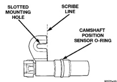
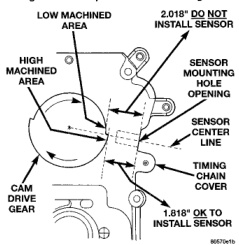
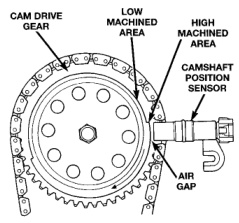

# 8D - 22 IGNITION SYSTEM

## REMOVAL AND INSTALLATION (Continued)

*Fig. 53 Camshaft Sensor O-Ring—8.0L V-10 Engine]*

material than necessary as damage to sensor may result. Due to a high magnetic field and possible electrical damage to the sensor, never use an electric grinder to remove material from sensor.

(2) From the parts department, obtain a peel-and-stick paper spacer (Fig. 52). These special paper spacers are of a certain thickness and are to be used as a tool to set sensor depth.

(3) Clean the face of sensor and apply paper spacer (Fig. 52).

(4) Apply a small amount of engine oil to the sensor o-ring (Fig. 53).

A low and high area are machined into the camshaft drive gear (Fig. 54). The sensor is positioned in the timing gear cover so that a small air gap (Fig. 54) exists between the face of sensor and the high machined area of cam gear.

Before the sensor is installed, the cam gear may have to be rotated. This is to allow the high machined area on the gear to be directly in front of the sensor mounting hole opening on the timing gear cover.

**Do not install sensor with gear positioned at low area (Fig. 55) or (Fig. 54). When the engine is started, the sensor will be broken.**

(5) Using a 1/2 in. wide metal ruler, measure the distance from the cam gear to the face of the sensor mounting hole opening on the timing gear cover (Fig. 55).

(6) If the dimension is approximately 1.818 inches, it is OK to install sensor. Proceed to step Step 9.

(7) If the dimension is approximately 2.018 inches, the cam gear will have to be rotated.

(8) Attach a socket to the vibration damper mounting bolt and rotate engine until the 1.818 inch dimension is attained.

(9) Install the sensor into the timing case/cover with a slight rocking action until the paper spacer contacts the camshaft gear. Do not install the sensor

*Fig. 54 Sensor Operation—8.0L V-10 Engine]*

*Fig. 52 Sensor Depth Dimensions]*

mounting bolt. Do not twist the sensor into position as damage to the o-ring or tearing of the paper spacer may result.

(10) Scratch a scribe line into the timing chain case/cover to indicate depth of sensor (Fig. 53).

(11) Remove the sensor from timing chain case/cover.

(12) Remove the paper spacer from the sensor. This step must be followed to prevent the paper
