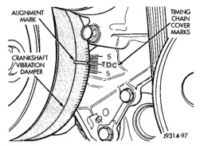
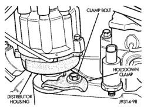
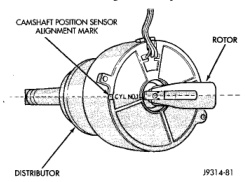

# 8D - 24 IGNITION SYSTEM

## REMOVAL AND INSTALLATION (Continued)

*Fig. 56 Damper-To-Cover Alignment Marks—Typical]*

(8) The distributor rotor should now be aligned to the CYL. NO. 1 alignment mark (stamped) into the camshaft position sensor (Fig. 57). If not, rotate the crankshaft through another complete 360 degree turn. Note the position of the number one cylinder spark plug cable (on the cap) in relation to rotor. Rotor should now be aligned to this position.

*Fig. 57 Rotor Alignment Mark]*

(9) Disconnect camshaft position sensor wiring harness from main engine wiring harness.

(10) Remove distributor rotor from distributor shaft.

(11) Remove distributor holddown clamp bolt and clamp (Fig. 58). Remove distributor from vehicle.

**CAUTION: Do not crank engine with distributor removed. Distributor/crankshaft relationship will be lost.**

*Fig. 58 Distributor Holddown Clamp]*

### INSTALLATION

If engine has been cranked while distributor is removed, establish the relationship between distributor shaft and number one piston position as follows:

Rotate crankshaft in a clockwise direction, as viewed from front, until number one cylinder piston is at top of compression stroke (compression should be felt on finger with number one spark plug removed). Then continue to slowly rotate engine clockwise until indicating mark (Fig. 56) is aligned to 0 degree (TDC) mark on timing chain cover.

(1) Clean top of cylinder block for a good seal between distributor base and block.

(2) Lightly oil the rubber o-ring seal on the distributor housing.

(3) Install rotor to distributor shaft.

(4) Position distributor into engine to its original position. Engage tongue of distributor shaft with slot in distributor oil pump drive gear. Position rotor to the number one spark plug cable position.

(5) Install distributor holddown clamp and clamp bolt. Do not tighten bolt at this time.

(6) Rotate the distributor housing until rotor is aligned to CYL. NO. 1 alignment mark on the camshaft position sensor (Fig. 57).

(7) Tighten clamp holddown bolt (Fig. 58) to 22.5 N-m (200 in. lbs.) torque.

(8) Connect camshaft position sensor wiring harness to main engine harness.

(9) Install distributor cap. Tighten mounting screws.

(10) Refer to the following, Checking Distributor Position.

### CHECKING DISTRIBUTOR POSITION

To verify correct distributor rotational position, the DRB scan tool must be used.
