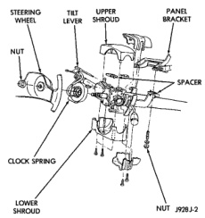
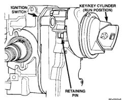

# 8D - 25 IGNITION SYSTEM

## REMOVAL AND INSTALLATION (Continued)

**WARNING: WHEN PERFORMING THE FOLLOWING TEST, THE ENGINE WILL BE RUNNING. BE CAREFUL NOT TO STAND IN LINE WITH THE FAN BLADES OR FAN BELT. DO NOT WEAR LOOSE CLOTHING.**

(1) Connect DRB scan tool to data link connector. The data link connector is located in passenger compartment, below and to left of steering column.

(2) Gain access to SET SYNC screen on DRB.

(3) Follow directions on DRB screen and start engine. Bring to operating temperature (engine must be in "closed loop" mode).

(4) With engine running at **idle speed**, the words IN RANGE should appear on screen along with 0 degrees. This indicates correct distributor position.

(5) If a plus (+) or a minus (-) is displayed next to degree number, and/or the degree displayed is not zero, loosen but do not remove distributor holddown clamp bolt. Rotate distributor until IN RANGE appears on screen. Continue to rotate distributor until achieving as close to 0 degrees as possible. After adjustment, tighten clamp bolt to 22.5 N-m (200 in. lbs.) torque.

The degree scale on SET SYNC screen of DRB is referring to fuel synchronization only. **It is not referring to ignition timing.** Because of this, do not attempt to adjust ignition timing using this method. Rotating distributor will have no effect on ignition timing. All ignition timing values are controlled by powertrain control module (PCM).

After testing, install air cleaner assembly.

### POWERTRAIN CONTROL MODULE (PCM)

Refer to Group 14, Fuel System for procedures.

## IGNITION SWITCH AND KEY CYLINDER

The ignition key must be in the key cylinder for cylinder removal.

### KEY CYLINDER REMOVAL

(1) Disconnect negative cable from battery.

(2) If equipped with tilt column, remove tilt lever by turning it counterclockwise.

(3) Remove upper and lower covers (shrouds) from steering column (Fig. 59).

(4) If equipped with automatic transmission, place shifter in PARK position.

(5) A retaining pin (Fig. 60) is located at side of key cylinder assembly.

(a) Rotate key to RUN position.

(b) Press in on retaining pin while pulling key cylinder from ignition switch.

### IGNITION SWITCH REMOVAL

(1) Remove key lock cylinder. Refer to previous steps.

*Fig. 59 Shroud Removal/Installation—Typical]*

*Fig. 60 Retaining Pin]*

(2) Remove 3 ignition switch mounting screws (Fig. 61). Use tamper proof torx bit (Snap-On SDMTR10 or equivalent) to remove screws.

(3) Gently pull switch away from column. Release connector locks on 7-terminal wiring connector at ignition switch and remove connector (Fig. 62).

(4) Release connector lock on 4-terminal halo lamp wiring connector and remove connector (Fig. 62).

## IGNITION SWITCH AND KEY CYLINDER INSTALLATION

If installing ignition key lock cylinder only, proceed to following steps 2, 3 and 4. Also refer to fol-
