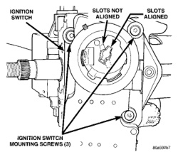
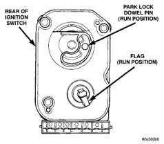
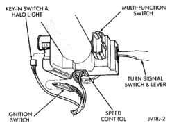
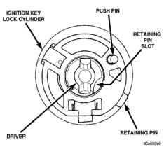

# 8D - 26 IGNITION SYSTEM

## REMOVAL AND INSTALLATION (Continued)

*Fig. 61 Switch Mounting Screws]*

*Fig. 62 Ignition Switch and Halo Lamp Connectors]*

lowing steps 12 through 18. If installing both switch and key cylinder, refer to steps 1 through 18.

(1) Rotate flag (Fig. 63) on rear of ignition switch until in RUN position. This step must be done to allow tang (Fig. 64) on key cylinder to fit into slots (Fig. 61) within ignition switch.

(2) With key into ignition key cylinder, rotate key clockwise until retaining pin can be depressed (Fig. 64) or (Fig. 65).

(3) Install key cylinder into ignition switch by aligning retaining pin into retaining pin slot (Fig. 65). Push key cylinder into switch until retaining pin engages. After pin engages, rotate key to OFF or LOCK position.

(4) Check for proper retention of key cylinder by attempting to pull cylinder from switch.

(5) Automatic Transmission Only: Before attaching ignition switch to steering column, the transmission

*Fig. 63 Flag in RUN Position]*

*Fig. 64 Key Cylinder—Rear View]*

shifter must be in PARK position. The park lock dowel pin on rear of ignition switch (Fig. 66) must also be properly indexed into the park lock linkage (Fig. 67) before installing switch.

(6) The flag at rear of ignition switch (Fig. 66) must be properly indexed into steering column before installing switch. This flag is used to operate the steering wheel lock lever in steering column (Fig. 68). This lever allows steering wheel position to be locked when key switch is in LOCK position.

(7) Place ignition switch in LOCK position. The switch is in the LOCK position when column lock flag is parallel to ignition switch terminals (Fig. 66).

(8) Automatic Transmission Only: Apply a light coating of grease to park lock dowel pin and park lock slider linkage. Before installing switch, push the
