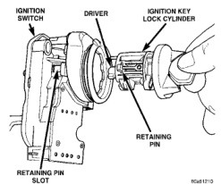
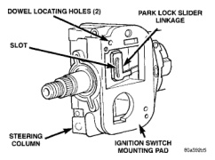
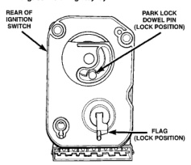
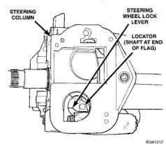

# 8D - 27 IGNITION SYSTEM

## REMOVAL AND INSTALLATION (Continued)

*Fig. 65 Installing Key Cylinder Into Switch]*

*Fig. 66 Ignition Switch View From Column]*

park lock slider linkage (Fig. 67) forward until it bottoms. Do a final positioning by pulling it rearward about one-quarter inch.

(9) Apply a light coating of grease to both column lock flag and shaft at end of flag.

(10) Place ignition switch into openings on steering column.

(a) Automatic Transmission Only: Be sure park lock dowel pin on rear of ignition switch enters slot in park lock slider linkage (Fig. 67).

(b) Be sure flag on rear of switch is positioned above steering wheel lock lever (Fig. 68).

(c) Align dowel pins on rear of switch into holes on side of steering column.

*Fig. 67 Park Lock Linkage—Automatic Transmission—Typical]*

*Fig. 68 Steering Wheel Lock Lever]*

(d) Install 3 ignition switch mounting screws. Tighten screws to 3 N-m +/- .5 N-m (26 in. lbs. +/- 4 in. lbs.) torque.

(11) Connect electrical connectors to ignition switch and halo lamp. Make sure that switch locking tabs are fully seated in wiring connectors.

(12) Install steering column covers (shrouds). Tighten screws to 2 N-m (17 in. lbs.) torque.

(13) Install tilt column lever (if equipped).

(14) Connect negative cable to battery.

(15) Check for proper operation of halo light.

(16) Automatic Transmission Only: Shifter should lock in PARK position when key is in LOCK position (if equipped with shift lock device). Shifter should unlock when key rotated to ON position.

(17) Check for proper operation of ignition switch in ACCESSORY, LOCK, OFF, ON, RUN, and START positions.
