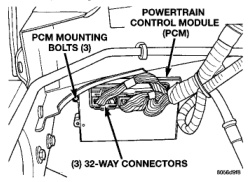

# 8D - 2 IGNITION SYSTEM BR

## SPECIFICATIONS

| Topic | Page |
|-------|------|
| ENGINE FIRING ORDER—3.9L V-6 ENGINE | 28 |
| ENGINE FIRING ORDER—5.2L/5.9L V-8 ENGINES | 28 |
| IGNITION COIL RESISTANCE—3.9L/5.2L/5.9L ENGINES | 29 |
| IGNITION COIL RESISTANCE—8.0L V-10 ENGINE | 29 |
| IGNITION TIMING | 28 |
| SPARK PLUG CABLE ORDER—8.0L V-10 ENGINE | 28 |
| SPARK PLUG CABLE RESISTANCE | 29 |
| SPARK PLUGS | 29 |
| TORQUE CHART | 29 |
| VECI LABEL | 28 |

## GENERAL INFORMATION

### INTRODUCTION

This group describes the ignition systems for 3.9L V-6, 5.2L/5.9L V-8, and 8.0L V-10 engines.

The 3.9L V-6 and 5.2L V-8 engines will be referred to in this Ignition Group as: Light Duty Cycle (LDC) engines. The 5.9L V-8 gas powered engine will be referred to as either: Light Duty Cycle (LDC) or Heavy Duty Cycle (HDC) engines. The 8.0L V-10 engine will be referred to as either: Medium Duty Cycle (MDC) or Heavy Duty Cycle (HDC) engines.

Either of the HDC gas powered engines can be easily identified by the use of an engine mounted air injection pump. The 3.9L V-6 engine, the 5.2/5.9L V-8 LDC or the 8.0L V-10 MDC gas engines will not use an air injection pump.

On Board Diagnostics is described in Group 25, Emission Control Systems.

Group 0, Lubrication and Maintenance, contains general maintenance information (in time or mileage intervals) for ignition related items. The Owner's Manual also contains maintenance information.

## DESCRIPTION AND OPERATION

### IGNITION SYSTEM—V-6/V-8 ENGINES

The ignition systems used on the 3.9L V-6, the 5.2L V-8 and the 5.9L V-8 are basically identical. Similarities and differences between the systems will be discussed.

The ignition system is controlled by the powertrain control module (PCM) on all engines.

The ignition system consists of:
- Spark Plugs
- Ignition Coil
- Secondary Ignition Cables
- Distributor (contains rotor and camshaft position sensor)
- Powertrain Control Module (PCM)
- Also to be considered part of the ignition system are certain inputs from the Crankshaft Position, Camshaft Position, Throttle Position and MAP Sensors

### IGNITION SYSTEM—8.0L V-10 ENGINE

The ignition system used on the 8.0L V-10 engine does not use a conventional mechanical distributor. The system will be referred to as a distributor-less ignition system. The ignition coils are individually fired, but each coil is a dual output. Refer to Ignition Coil Pack for additional information.

The ignition system is controlled by the powertrain control module (PCM) on all engines.

The ignition system consists of:
- Spark Plugs
- Ignition Coil Packs containing individual coils
- Secondary Ignition Cables
- Powertrain Control Module (PCM)
- Also to be considered part of the ignition system are certain inputs from the Crankshaft Position, Camshaft Position, Throttle Position and MAP Sensors

### POWERTRAIN CONTROL MODULE

The Powertrain Control Module (PCM) is located in the engine compartment (Fig. 1).

*Fig. 1 Powertrain Control Module (PCM)]*

The ignition system is controlled by the PCM.

**NOTE: On 3.9L/5.2L/5.9L engines, base ignition timing by rotation of distributor is not adjustable.**
