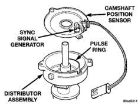

# BR IGNITION SYSTEM 8D - 3

## DESCRIPTION AND OPERATION (Continued)

The PCM opens and closes the ignition coil ground circuit (or circuits) to operate the ignition coil (or coil packs). This is done to adjust ignition timing, both initial (base) and advance, and for changing engine operating conditions.

The amount of electronic spark advance provided by the PCM is determined by five input factors: engine coolant temperature, engine rpm, intake manifold temperature, manifold absolute pressure and throttle position.

### DISTRIBUTOR

All 3.9L V-6 and 5.2L/5.9L V-8 engines are equipped with a conventional camshaft driven mechanical distributor containing a shaft driven distributor rotor. The distributor is equipped with the camshaft position (fuel sync) sensor (Fig. 2). This sensor provides fuel injection synchronization and cylinder identification.

*Fig. 2 Distributor and Camshaft Position Sensor—Typical]*

The distributor does not have built in centrifugal or vacuum assisted advance. Base ignition timing and all timing advance is controlled by the Powertrain Control Module (PCM). Because ignition timing is controlled by the PCM, **base ignition timing is not adjustable.**

The distributor is held to the engine in the conventional method using a holddown clamp and bolt. **Although the distributor can be rotated, it will have no effect on ignition timing.**

All distributors contain an internal oil seal that prevents oil from entering the distributor housing. The seal is not serviceable.

### SPARK PLUGS

The 3.9L V-6 and 5.2L/5.9L V-8 engines use resistor type spark plugs. The 8.0L V-10 engine uses inductive type spark plugs. Remove the spark plugs and examine them for burned electrodes and fouled, cracked or broken porcelain insulators. Keep plugs arranged in the order in which they were removed from the engine. A single plug displaying an abnormal condition indicates that a problem exists in the corresponding cylinder. Replace spark plugs at the intervals recommended in Group 0, Lubrication and Maintenance.

Spark plugs that have low mileage may be cleaned and reused if not otherwise defective, carbon or oil fouled. Refer to the Spark Plug Condition section of this group.

### SPARK PLUG CABLES

Spark plug cables are sometimes referred to as secondary ignition wires. These cables transfer electrical current from the ignition coil(s) and/or distributor, to individual spark plugs at each cylinder. The resistive spark plug cables are of nonmetallic construction. The cables provide suppression of radio frequency emissions from the ignition system.

### IGNITION COIL—3.9L/5.2L/5.9L ENGINES

Battery voltage is supplied to the ignition coil positive terminal from the ASD relay.

The Powertrain Control Module (PCM) opens and closes the ignition coil ground circuit for ignition coil operation.

**Base ignition timing is not adjustable on any engine.** By controlling the coil ground circuit, the PCM is able to set the base timing and adjust the ignition timing advance. This is done to meet changing engine operating conditions.

The ignition coil is not oil filled. The windings are embedded in an epoxy compound. This provides heat and vibration resistance that allows the ignition coil to be mounted on the engine.

### IGNITION COIL PACKS—8.0L ENGINE

The ignition system used on the 8.0L V-10 engine does not use a conventional mechanical distributor. It will be referred to as a distributor-less ignition system. Ignition timing is not adjustable on any 8.0L V-10 engine.

Two separate coil packs containing a total of five independent coils are attached to a common mounting bracket located above the right engine valve cover (Fig. 3). The coil packs are not oil filled. The front coil pack contains three independent epoxy filled coils. The rear coil pack contains two independent epoxy filled coils.

When one of the 5 independent coils discharges, it fires two paired cylinders at the same time (one cylinder on compression stroke and the other cylinder on exhaust stroke).

Coil firing is paired together on cylinders:
- Number 5 and 10
